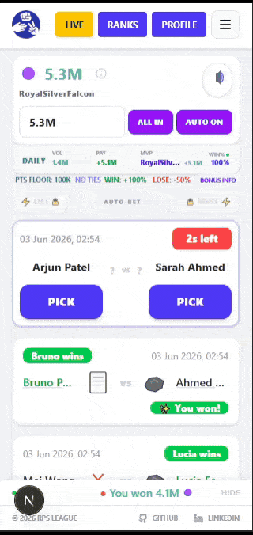

# Integrated Achievement Codex

The Integrated Achievement Codex is a multi-tier progression system designed to track and reward every facet of player interaction within the RPS simulation from economic wealth and match mastery to global event participation and identity persistence.

## 🏛️ System Architecture

### 1. Rarity Hierarchy
Achievements are categorized into six distinct rarity tiers, each with its own visual language, card border, and animated profile aura:
*   🟢 **COMMON**: Foundational milestones.
*   🔵 **RARE**: Established consistency.
*   🟣 **EPIC**: Significant expertise.
*   🟡 **LEGENDARY**: Elite performance.
*   🔴 **MYTHICAL**: Master-level simulation anomalies.
*   🌈 **RAINBOW**: Seasonal peaks and absolute ecosystem mastery.

### 2. Dynamic Badge Upgrading
The Codex uses a "Highest Earned" logic for chained achievements. For example, when a user unlocks the **Rare** tier of a win streak, it automatically supersedes the **Common** version in their inventory. This keeps the badge showcase focused on the player's peak accomplishments.

### 3. Identity Showcase
Users are provided with **5 dedicated badge slots** on their public identity. These slots can be filled with any earned achievement or the opt-in LinkedIn social badge. This selection is mirrored globally on the Leaderboard.

  <strong>Achievement System in Action</strong> 
  

---

## ⚔️ Category 1: The Combatants (Volume)
*Tracking total successful predictions across the bot league.*

| Rarity | Name | Requirement | Icon | Code |
| :--- | :--- | :--- | :--- | :--- |
| 🟢 Common | Skirmisher | 50 Total Wins | 🛡️ | `50W` |
| 🔵 Rare | Centurion | 100 Total Wins | 🎖️ | `100W` |
| 🟣 Epic | Veteran | 250 Total Wins | ⚔️ | `250W` |
| 🟡 Legendary | Commander | 500 Total Wins | 🏛️ | `500W` |
| 🔴 Mythical | Gladiator | 1,000 Total Wins | 👑 | `GLAD` |

---

## 🔥 Category 2: Momentum (Streaks)
*Rewarding consecutive win chains.*

| Rarity | Name | Requirement | Icon | Code |
| :--- | :--- | :--- | :--- | :--- |
| 🟢 Common | Steady Hand | 3-Win Streak | 📈 | `STK3` |
| 🔵 Rare | On Fire | 5-Win Streak | 🔥 | `HOT` |
| 🟣 Epic | Inferno | 10-Win Streak | 🌋 | `FIRE` |
| 🟡 Legendary | Beast Mode | 15-Win Streak | 💠 | `BST` |
| 🔴 Mythical | Ascended | 20-Win Streak | 🧘 | `ZEN` |

---

## 🔄 Category 3: The Lapping Ecosystem (Prestige)
*Progression through the Chrono-Lap ascension system.*

| Rarity | Name | Requirement | Icon | Code |
| :--- | :--- | :--- | :--- | :--- |
| 🟢 Common | Rebirth | 1 Full Lap | ♻️ | `LAP1` |
| 🔵 Rare | Cycler | 5 Full Laps | 🌀 | `LAP5` |
| 🟣 Epic | Lapse King | 10 Full Laps | 🔄 | `10LP` |
| 🟡 Legendary | Eternal | 25 Full Laps | ⏳ | `25LP` |
| 🔴 Mythical | Time Lord | 50 Full Laps | ⌛ | `LORD` |

---

## 🌌 Category 4: Dimensional Scale (Wealth)
*Tracking the accumulation of raw point mass.*

| Rarity | Name | Requirement | Icon | Code |
| :--- | :--- | :--- | :--- | :--- |
| 🟢 Common | Trillionaire | Reach 1 Trillion | 💰 | `1TRL` |
| 🔵 Rare | Quadrillionaire | Reach 1 Quadrillion | 💎 | `1QAD` |
| 🟣 Epic | Vigintillionaire | Reach 1 Vigintillion | 🌌 | `1VIG` |
| 🟡 Legendary | Infinity Bound | Reach 1 Octovigintillion | ♾️ | `1OVG` |
| 🟡 Legendary | Trigintillion Sovereign | Reach 1 Trigintillion | 🌀 | `1TRG` |
| 🔴 Mythical | Cosmic Transcendence | Reach 1 Trestrigintillion | ☄️ | `1TTR` |
| 🔴 Mythical | Absolute Zenith | Reach 1 Sextrigintillion | 🌟 | `1STR` |
| 🔴 Mythical | The Singularity | Reach 999 Sextrigintillion | 🧿 | `999X` |

---

## 💥 Category 5: Multiplier Madness (Math)
*Achieving extreme value through match multipliers.*

| Rarity | Name | Requirement | Icon | Code |
| :--- | :--- | :--- | :--- | :--- |
| 🟢 Common | Amplified | Reach x10 Match Multiplier | ⚡ | `10X` |
| 🔵 Rare | Surge | Reach x30 Match Multiplier | 🌪️ | `50X` |
| 🟣 Epic | Nuclear | Reach x60 Match Multiplier | ☢️ | `NUKE` |
| 🟡 Legendary | Supernova | Reach x100 Match Multiplier | 🌟 | `NOVA` |
| 🔴 Mythical | The Big One | Trigger a x3 Mythic Relic Slam | 🧨 | `BOOM` |

---

## 🧿 Category 6: The Reliquary (Collection)
*Tracking the acquisition of simulation artifacts.*

| Rarity | Name | Requirement | Icon | Code |
| :--- | :--- | :--- | :--- | :--- |
| 🟢 Common | Scavenger | Own 5 Unique Relics | 📁 | `5RL` |
| 🔵 Rare | Collector | Own 10 Unique Relics | 🎒 | `10RL` |
| 🟣 Epic | True Curator | Own all Common, Rare & Epic Relics | 🏛️ | `MUSE` |
| 🟡 Legendary | Full House | Own all 17 Unique Relics | 🎰 | `FULL` |
| 🔴 Mythical | Trinity | Own all 3 Mythical Relics | 🔱 | `TRI` |

---

## 🌙 Category 7: Moon's Blessing (Lunar Track)
*Flash Event mastery for the Lunar theme.*

| Rarity | Name | Requirement | Icon | Code |
| :--- | :--- | :--- | :--- | :--- |
| 🟢 Common | New Moon | 5 Moon Activations | 🌑 | `LUN1` |
| 🔵 Rare | Orbit | 10 Moon Activations | 🛰️ | `LUN2` |
| 🟣 Epic | High Tide | 25 Moon Activations | 🌊 | `LUN3` |
| 🟡 Legendary | Full Eclipse | 50 Moon Activations | 🌑 | `LUN4` |
| 🔴 Mythical | Moon God | 100 Moon Activations | 🌙 | `LUNA` |

---

## ⚡ Category 8: Electric Surge (Electric Track)
*Flash Event mastery for the Electric theme.*

| Rarity | Name | Requirement | Icon | Code |
| :--- | :--- | :--- | :--- | :--- |
| 🟢 Common | Static | 5 Electric Activations | 🎈 | `VOL1` |
| 🔵 Rare | Current | 10 Electric Activations | 🔋 | `VOL2` |
| 🟣 Epic | Overload | 25 Electric Activations | 🔌 | `VOL3` |
| 🟡 Legendary | Supercell | 50 Electric Activations | ⛈️ | `VOL4` |
| 🔴 Mythical | Thunder God | 100 Electric Activations | ⚡ | `VOLT` |

---

## 🔥 Category 9: Hellfire (Hellfire Track)
*Flash Event mastery for the Hellfire theme.*

| Rarity | Name | Requirement | Icon | Code |
| :--- | :--- | :--- | :--- | :--- |
| 🟢 Common | Embers | 5 Hellfire Activations | 🕯️ | `HEL1` |
| 🔵 Rare | Scorch | 10 Hellfire Activations | 🥓 | `HEL2` |
| 🟣 Epic | Blaze | 25 Hellfire Activations | 🎇 | `HEL3` |
| 🟡 Legendary | Inferno | 50 Hellfire Activations | 🌋 | `HEL4` |
| 🔴 Mythical | Apocalypse | 100 Hellfire Activations | 🔥 | `HELL` |

---

## 🃏 Category 10: Luck in the Card (Cards Track)
*Flash Event mastery for the Cards theme.*

| Rarity | Name | Requirement | Icon | Code |
| :--- | :--- | :--- | :--- | :--- |
| 🟢 Common | The Ante | 5 Cards Activations | 🪙 | `CRD1` |
| 🔵 Rare | Dealer | 10 Cards Activations | 🤝 | `CRD2` |
| 🟣 Epic | Full House | 25 Cards Activations | 🏰 | `CRD3` |
| 🟡 Legendary | Jackpot | 50 Cards Activations | 🎰 | `CRD4` |
| 🔴 Mythical | The Ace | 100 Cards Activations | 🃏 | `CARD` |

---

## 🔮 Category 11: Oracle Prophecy (Daily)
*Tracking consecutive days of Oracle consultation.*

| Rarity | Name | Requirement | Icon | Code |
| :--- | :--- | :--- | :--- | :--- |
| 🟢 Common | Seer Apprentice | Use Oracle 3 Days in a Row | 🔮 | `ORC3` |
| 🔵 Rare | Clairvoyant | Use Oracle 7 Days in a Row | 🌠 | `ORC7` |
| 🟣 Epic | Prophet | Use Oracle 14 Days in a Row | 👁 | `ORCL` |
| 🟡 Legendary | Chrono Scholar | Use Oracle 30 Days in a Row | 📅 | `CHRON` |
| 🔴 Mythical | Omniscient | Use Oracle 60 Days in a Row | 🌌 | `OMNI` |

---

## 🎯 Category 12: Meta & Special
*Unique emergent behaviors and session milestones.*

| Rarity | Name | Requirement | Icon | Code |
| :--- | :--- | :--- | :--- | :--- |
| 🟢 Common | Pity King | Trigger Bonus Pity 100 times | 🩹 | `PITY` |
| 🔵 Rare | Founder | Play during launch month | ⭐ | `FND` |
| 🔵 Rare | Autopilot | Toggle on Auto-Bet for the first time | ⚙️ | `AUTO` |
| 🟣 Epic | Riding the Wave | Win 3 consecutive predictions during a single active Tidal Surge window | 🌊 | `TIDE` |
| 🟣 Epic | Solar Maximum | Win a match during a Solar Flare while on an Inferno Win Streak (5+ wins) | ☀️ | `SOL` |
| 🟣 Epic | Vortex Velocity | Reach a 10-win streak during a Cyclone Blitz | 🌪️ | `CYCL` |
| 🟣 Epic | Cosmic Alignment | Win a match while both a personal Flash Event and a server-wide Global Event are active simultaneously | 🪐 | `SYZY` |
| 🟡 Legendary | Fata Morgana | Roll a 45%+ Echo Bonus on a win during a Mirage Cataclysm | 🏜️ | `MIR` |
| 🔴 Mythical | God-Killer | Win with x100+ multiplier | 👺 | `SLAY` |
| 🔴 Mythical | Fever Dream | Back-to-back Flash Events on consecutive matches | 💤 | `DREM` |
| 🔴 Mythical | Storm Chaser | Experience all 4 Flash Event themes in one session | 🌪️ | `STRM` |
| 🔴 Mythical | Cataclysm Surveyor | Participate 15 times in each of the four separate Global Events | 🔱 | `CATA` |

---

## 🎪 Category 13: Festival Catalyst
*Tracking global event triggering and participation.*

| Rarity | Name | Requirement | Icon | Code |
| :--- | :--- | :--- | :--- | :--- |
| 🟢 Common | Spark Initiator | Trigger 1 Festival | 🔋 | `FES1` |
| 🔵 Rare | System Catalyst | Trigger 5 Festivals | 🌀 | `FES2` |
| 🟣 Epic | Instability Driver | Trigger 15 Festivals | ⚡ | `FES3` |
| 🟡 Legendary | Oracle Breaker | Trigger 30 Festivals | 👁️‍🗨️ | `FES4` |
| 🔴 Mythical | System Anomaly | Trigger 50 Festivals | 🚨 | `FEST` |
| 🟢 Common | Node Arrival | Participate in 5 Festivals | 📍 | `NET1` |
| 🔵 Rare | Grid Intrusive | Participate in 15 Festivals | 🗺️ | `NET2` |
| 🟣 Epic | Phase Interlocking | Participate in 30 Festivals | ⛓️ | `NET3` |
| 🟡 Legendary | Matrix Core | Participate in 60 Festivals | 🕸️ | `NET4` |
| 🔴 Mythical | Overmesh | Participate in 100 Festivals | 🌐 | `MESH` |

---

## 📖 Category 14: The Grand Archive (Collector)
*Rewarding the completion of the achievement codex itself.*

| Rarity | Name | Requirement | Icon | Code |
| :--- | :--- | :--- | :--- | :--- |
| 🟢 Common | Curious | Earn 20 Achievements | 📖 | `COL20` |
| 🔵 Rare | Dedicated | Earn 40 Achievements | 📚 | `COL40` |
| 🟣 Epic | Completionist | Earn 65 Achievements | 🗂️ | `COL65` |
| 🟡 Legendary | Archivist | Earn 95 Achievements | 🏛️ | `COL95` |
| 🔴 Mythical | Omnivore | Earn 142 Achievements | 🌟 | `COLMAX` |

---

## 🪐 Category 15: Cosmic (Global Events)
*Ecosystem tracking across all Unified Server Events.*

### Global Unified Track
| Rarity | Name | Requirement | Icon | Code |
| :--- | :--- | :--- | :--- | :--- |
| 🟢 Common | Event Horizon | Participate in 1 Global Event | 🌌 | `GLO1` |
| 🔵 Rare | Phenomenon | Participate in 10 Global Events | 🌍 | `GLO2` |
| 🟣 Epic | Aether Drifter | Participate in 25 Global Events | 🌠 | `GLO3` |
| 🟡 Legendary | Nexus Walker | Participate in 50 Global Events | 🌀 | `GLO4` |
| 🔴 Mythical | Force of Nature | Participate in 100 Global Events | 💫 | `GLOB` |

### Tidal Surge Track
| Rarity | Name | Requirement | Icon | Code |
| :--- | :--- | :--- | :--- | :--- |
| 🟢 Common | Neap Tide | Participate in 3 Tidal Surges | 🌊 | `TSU1` |
| 🔵 Rare | Spring Tide | Participate in 7 Tidal Surges | 💧 | `TSU2` |
| 🟣 Epic | Abyssal Drift | Participate in 15 Tidal Surges | 🐳 | `TSU3` |
| 🟡 Legendary | Maelstrom | Participate in 25 Tidal Surges | 🌀 | `TSU4` |
| 🔴 Mythical | Tsunami Sovereign | Participate in 50 Tidal Surges | 👑 | `TSU5` |

### Solar Flare Track
| Rarity | Name | Requirement | Icon | Code |
| :--- | :--- | :--- | :--- | :--- |
| 🟢 Common | Corona | Participate in 3 Solar Flares | 🔅 | `SFL1` |
| 🔵 Rare | Solar Wind | Participate in 7 Solar Flares | 💨 | `SFL2` |
| 🟣 Epic | Prominence | Participate in 15 Solar Flares | 🔥 | `SFL3` |
| 🟡 Legendary | Coronal Ejection | Participate in 25 Solar Flares | ☄️ | `SFL4` |
| 🔴 Mythical | Heliosphere | Participate in 50 Solar Flares | ☀️ | `SFL5` |

### Cyclone Blitz Track
| Rarity | Name | Requirement | Icon | Code |
| :--- | :--- | :--- | :--- | :--- |
| 🟢 Common | Gale | Participate in 3 Cyclone Blitzes | 🍃 | `CBL1` |
| 🔵 Rare | Squall | Participate in 7 Cyclone Blitzes | 🌬️ | `CBL2` |
| 🟣 Epic | Tempest | Participate in 15 Cyclone Blitzes | 🌩️ | `CBL3` |
| 🟡 Legendary | Eye of the Storm | Participate in 25 Cyclone Blitzes | 👁 | `CBL4` |
| 🔴 Mythical | Zephyr King | Participate in 50 Cyclone Blitzes | 👑 | `CBL5` |

### Mirage Cataclysm Track
| Rarity | Name | Requirement | Icon | Code |
| :--- | :--- | :--- | :--- | :--- |
| 🟢 Common | Haze | Participate in 3 Mirage Cataclysms | 🌫️ | `MCA1` |
| 🔵 Rare | Shimmer | Participate in 7 Mirage Cataclysms | ✨ | `MCA2` |
| 🟣 Epic | Sandstorm | Participate in 15 Mirage Cataclysms | 🏜️ | `MCA3` |
| 🟡 Legendary | Oasis Phantom | Participate in 25 Mirage Cataclysms | 🌴 | `MCA4` |
| 🔴 Mythical | Master of Illusion | Participate in 50 Mirage Cataclysms | 🔮 | `MCA5` |

---

## ⚔️ Category 16: World Boss Arena
*Progression tracking for simulated entity combat and vaults.*

### Defeat Track
| Rarity | Name | Requirement | Icon | Code |
| :--- | :--- | :--- | :--- | :--- |
| 🟢 Common | First Contact | Defeat 1 World Boss | ⚔️ | `WB01` |
| 🔵 Rare | Entity Hunter | Defeat 10 World Bosses | 🛡️ | `WB02` |
| 🟣 Epic | World Defender | Defeat 30 World Bosses | 🌍 | `WB03` |
| 🟡 Legendary | Cataclysm Breaker | Defeat 75 World Bosses | 💥 | `WB04` |
| 🔴 Mythical | World Savior | Defeat 200 World Bosses | 🌟 | `WB05` |
| 🔴 Mythical | Hexurion's Bane | Defeat Hexurion 50 times | ⬢ | `HEXM` |
| 🔴 Mythical | Orbitbreaker | Defeat Orphion 50 times | 🪐 | `ORBM` |
| 🔴 Mythical | Fractal Collapse | Defeat Fracturon 50 times | 💎 | `FRAM` |
| 🔴 Mythical | Pyramid Fall | Defeat Apexion 50 times | 🔺 | `APXM` |

### Chest & Vault Track
| Rarity | Name | Requirement | Icon | Code |
| :--- | :--- | :--- | :--- | :--- |
| 🟢 Common | Treasure Seeker | Open 5 World Boss Chests | 📦 | `CH01` |
| 🔵 Rare | Treasure Hunter | Open 20 World Boss Chests | 🎁 | `CH02` |
| 🟣 Epic | Vault Raider | Open 50 World Boss Chests | 💰 | `CH03` |
| 🟡 Legendary | Treasure Hoard | Open 100 World Boss Chests | 🏆 | `CH04` |
| 🔴 Mythical | Living Vault | Open 250 World Boss Chests | 👑 | `CH05` |

### World Boss Meta Accomplishments
| Rarity | Name | Requirement | Icon | Code |
| :--- | :--- | :--- | :--- | :--- |
| 🟢 Common | Final Strike | Land the finishing blow on a World Boss | 🎯 | `LAST` |
| 🔵 Rare | Perfect Assault | Defeat a World Boss without missing a single prediction | 💯 | `PERF` |
| 🔵 Rare | Lucky Shot | Land the finishing blow while contributing 10% or less of total boss damage | 🍀 | `LUCK` |
| 🟣 Epic | Clutch Victory | Land the finishing blow with less than 5 seconds remaining | ⏱️ | `CLUT` |
| 🔴 Mythical | Divine Intervention | Join a World Boss during its final 10 seconds and land the finishing blow | 🌠 | `DIVN` |

---

## 🎰 Category 17: Neon Paradise
*Tracking metrics and masteries inside the Neon Paradise bonus stages and minigames.*

### Milestone Track
| Rarity | Name | Requirement | Icon | Code |
| :--- | :--- | :--- | :--- | :--- |
| 🟢 Common | Paradise Visitor | Trigger 1 bonus stage | 🎰 | `NEO1` |
| 🔵 Rare | Paradise Explorer | Trigger 10 bonus stages | 🎰 | `NEO2` |
| 🟣 Epic | Paradise Regular | Trigger 50 bonus stages | 🎰 | `NEO3` |
| 🟡 Legendary | Paradise Legend | Trigger 150 bonus stages | 🎰 | `NEO4` |
| 🔴 Mythical | Neon Sovereign | Trigger 300 bonus stages | 👑 | `NEO5` |

### Minigame Masteries & Challenges
| Rarity | Name | Requirement | Icon | Code |
| :--- | :--- | :--- | :--- | :--- |
| 🟡 Legendary | Open the Royal Chest | Get the 10x reward from Treasure Vault | 🏆 | `TVLT` |
| 🟡 Legendary | Find the Royal Chest | Pick the Royal chest in King's Vault | 👑 | `KVAL` |
| 🟡 Legendary | Reach the 10× Payout | Reach step 3 in Double Down | ⚡ | `DON3` |
| 🟡 Legendary | Reveal the Maximum Combination | Flip three Oracle cards in Wild Prediction | 🃏 | `WILD` |
| 🟡 Legendary | Reach the 10× Payout | Get the 10× reward in Surge Frenzy | ⚡ | `SFX5` |
| 🟡 Legendary | Roll Rainbow Tier | Average Rainbow spectrum in Rainbow Rush | 🌈 | `RRSH` |
| 🟡 Legendary| Hit the Perfect Bullseye | Get the 10× reward in Sniper Challenge | 🎯 | `SNIP` |
| 🟡 Legendary | Complete All Five Sequences | Complete all 5 sequences in Oracle Vision | 🔮 | `OVIS` |
| 🟡 Legendary  | Strike the Motherlode | Find 5 diamonds for the 10× reward in Crystal Mine | 💎 | `MINE` |

### Multi-Game Complete Achievements
| Rarity | Name | Requirement | Icon | Code |
| :--- | :--- | :--- | :--- | :--- |
| 🟣 Epic | Complete Every Neon Paradise Minigame | Play all 9 bonus stages at least once | 🌈 | `NEO9` |
| 🟡 Legendary | Complete Every Minigame 20 Times | 20 clears of every bonus stage | 🌈 | `NE20` |
| 🟡 Legendary | Play Every Minigame in a Single Day | All 9 bonus stages in one calendar day | 🌈 | `CIRC` |

---

## 🎲 Category 18: Miscellaneous

*Hidden accomplishments revealed only upon acquisition.*

Reveal hidden achievements

| Rarity | Name | Requirement | Icon | Code |
| :--- | :--- | :--- | :--- | :--- |
| 🔵 Rare | The Rebel | Bet against the Oracle | 🎭 | `REBL` |
| 🔵 Rare | Dry Mirage | Roll the minimum Echo Bonus (15%) on a win during Mirage Cataclysm | 🏜️ | `DRYM` |
| 🔵 Rare | Eye of the Storm | Have your win streak shielded by the Buffer Module during Cyclone Blitz | 🛡️ | `EYEC` |
| 🟣 Epic | Prismatic Wave | Win a match during Tidal Surge with the Prismatic Shard equipped | 💎 | `PRIS` |
| 🔴 Mythical | Thermal Fusion | Trigger a Soul of the Machine Mythic Slam on a win during a Solar Flare | ☀️ | `FUSN` |

---

## 👑 The Peak (Rainbow Rarity)
*The ultimate seasonal master achievement.*

| Rarity | Name | Requirement | Icon | Code |
| :--- | :--- | :--- | :--- | :--- |
| 🌈 Rainbow | God King | 1000 Wins + 50 Laps + Trinity of Relics | 👑 | `KING` |
| 🌈 Rainbow | Cosmic Sovereign | Participate 50 times in each of the 4 Global Events | 🪐 | `COSM` |
| 🌈 Rainbow | World Purifier | Defeat each of the four World Bosses 50 times | 🌍 | `PURI` |
| 🌈 Rainbow | Paradise Ascendant | 50 clears of every bonus stage | 🌈 | `NEON` |