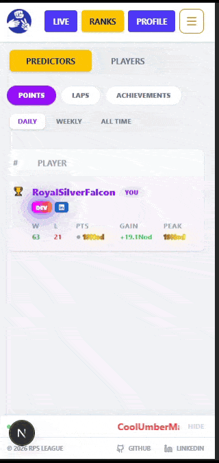
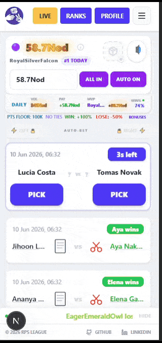

# 📹 Media Gallery

A complete visual archive of the RPS League ecosystem.

### 🚩 Primary Feature Showcases
Detailed gameplay and cinematic recordings for core systems:
> 🕹️ [**Flash Event Deep-Dive** →](./FLASHEVENTS.md)

> 🎭 [**Player Festival Deep-Dive** →](./FESTIVALS.md)

> 🪐 [**Global Event Deep-Dive** →](./GLOBALEVENTS.md)

---

### 🔍 Extended Feature Showcases
Visual breakdowns of UI systems, automation, and reliability tools:
## 🏆 Achievement Badges Leaderboard Styling (Mythical & Rainbow)

Achievement badges are earned through player milestones and progression. When equipped, they visually transform leaderboard rows to reflect achievement rarity and status. Mythical achievement badges create a deep red reactive energy field that gives the row a volatile, high-intensity presence, while Rainbow achievement badges represent the highest achievement tier and fully override all visuals with a shifting multicolor shimmer that continuously flows across the row.

  <strong>Achievement Badge Styling Showcase (Mythical + Rainbow)</strong> 
  

---

## 🎁 Bonus Explainer Modal Showcase

The Bonus Explainer Modal is an in-game achievement reference system that explains core mechanics such as bonuses, streaks, flash events, relics, and festivals. It is designed to help players understand how progression systems connect to rewards and how achievement-based mechanics influence outcomes across gameplay.

  <strong>Bonus Explainer Modal Showcase</strong> 
  

---

## 🤖 Idle Auto-Bet Mode

Idle auto-betting system that automatically places your selected bet on your chosen side for every incoming match after unlock.

Unlocked after reaching Ascension (999 STR) or starting Lap 1.

  <strong>Idle Auto-Bet Mode Showcase</strong> 
  

---

## 🤖 Daily Oracle & Point Style Selection

Once per day the Oracle issues a guaranteed prediction, picks a side server-side, and rigs the outcome if followed. Usage is tracked in the database so clearing browser data grants nothing. Point style selection lets players pin any visual tier they have unlocked via all-time peak.

  <strong>Daily Oracle Prophecy and Point Style Customization</strong> 
  

---

## 📋 Update History & Modal

A sorted accordion documenting all versions from launch to present. Returning players see a version-aware modal on load showing exactly what changed since their last session. New players hit the welcome flow instead.

  <strong>In-app Update Log and What's New Modal</strong> 
  

---

## 🔮 Reliability & Feedback Portal

Sentry integrated across the full stack for runtime and SSE monitoring. The in-app feedback portal automatically bundles game state, environment metadata, and screenshot support. Manual reports are trace-linked directly to Sentry event IDs for instant lookup.

<table>
  <tr>
    <td></td>
    <td></td>
    <td></td>
  </tr>
</table>