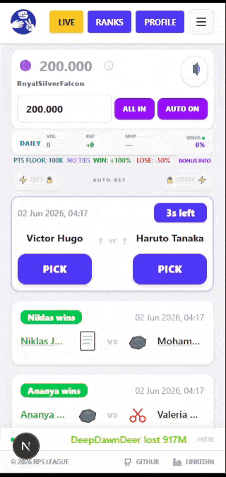
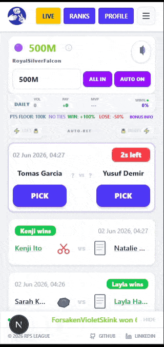
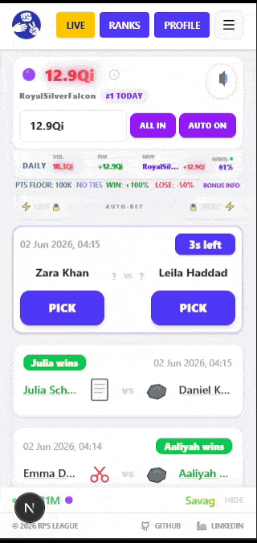
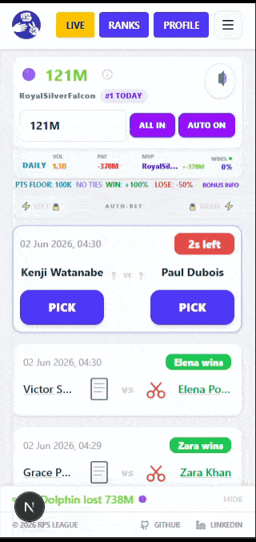
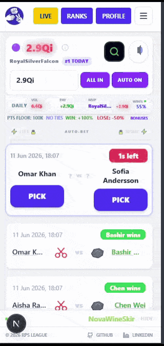
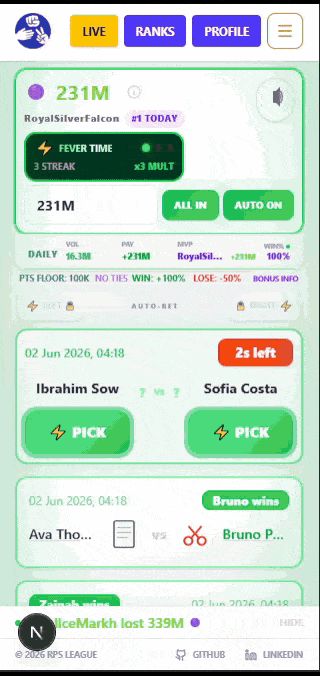

# 👁️ Player Festivals

Festivals are rare, globally-triggered gameplay events initiated by specific player actions. Unlike Flash Events which are personal and probabilistic, Festivals affect all active players simultaneously and are driven by emergent in-game milestones.

The Oracle system also runs autonomous demo festivals during low-concurrency periods, simulating world activity when no player-triggered festival has occurred recently.

---

## System Rules

- **One at a time**: only one Festival can be active globally. Triggers during an active Festival or cooldown are discarded.
- **5-minute cooldown**: a mandatory lockout follows every Festival conclusion. No queue exists.
- **Flash Events override**: Flash Event UI theming takes visual priority over an active Festival theme.
- **Oracle overrides all**: a player who defied the Daily Oracle Prophecy will still lose even during Sanguine's forced-win state.
- **Triggered by players**: every Festival is caused by a specific player action, and that player's name is broadcast to all active players via the Oracle ticker.
- **Autonomous demo festivals**: if no player festival has occurred in the last 10 minutes and no cooldown is active, the Oracle triggers a weighted random festival every 18 to 24 minutes to simulate world activity.

---

## The Spark Festival

**Trigger:** 2 Flash Events completed in a row (100%) OR hitting a Legendary or Mythical Bonus during a Flash Event (100%)

**Duration:** Immediate activation + 45 seconds

**Effect: Universal Synchronization**
All active players instantly enter a Flash Event with 3 Flash Bets. Players already in a Flash Event have their remaining Flash Bets refilled to 3.

**Streak Trigger Bonus:** If triggered by completing 2 Flash Events in a row, the initiating player receives a guaranteed Bonus Roll (Common through Legendary) on their next 3 predictions.

**Expiration:** All Flash Events created by The Spark Festival expire when the 45-second protocol window ends. Flash Events earned independently during the festival are unaffected and continue normally.

**Theme:** Neon Violet and Electric Purple, vivid border glows and high-frequency light pulses

  <strong>Spark Festival in Action</strong> 
  

---

## The Ghost Festival

**Trigger:** Total win multiplier 30x or higher (40% chance) OR 60x or higher (100%)

**Duration:** 1 minute, 12 matches

**Effect: Win Echo**
All wins generate a 20% signal echo. The final payout is multiplied by 1.2x.

The echo is visualised in the result animation: after the result number finishes counting up, a ghostly echo value (20% of the final amount) drifts upward to the top-right and fades out with a teal glow effect.

**Theme:** Ethereal Teal and Ghost White, transparent floating particles, drifting echo silhouettes

  <strong>Ghost Festival in Action</strong> 
  

---

## The Safeguard Festival

**Trigger:** Completion of a Mythical Achievement (100%) OR Legendary Achievement (50%)

**Duration:** 1 minute, 12 matches

**Effect: Risk Shield**
Loss deductions are reduced by 20%. Losses only deduct 40% of the stake instead of the standard 50%.

**Theme:** Slate Blue and Shield Silver, metallic border-frame overrides, geometric shield-shimmer effects

  <strong>Safeguard Festival in Action</strong> 
  

---

## The Resonance Festival

**Trigger:** 3 tiered bonuses in a row (100%) OR Legendary Bonus (30% chance)

**Duration:** 40 seconds, 8 matches

**Effect: Bonus Stabilization**
Every prediction is guaranteed to roll a Common or Rare Bonus. Epic and Legendary tiers are capped. Any roll that would produce Epic or higher is recalculated as a Rare outcome, producing a deterministic 100% Rare state.

**Theme:** Lustrous Amber and Solar Gold, radiant golden aura expanding from the resolution area

  <strong>Resonance Festival in Action</strong> 
  

---

## The Surge Festival

**Trigger:** Completion of a Chrono-Lap (Ascension), 100%

**Duration:** 30 seconds, 6 matches

**Effect: Power Surge**
A 2x global multiplier is applied to all win payouts for the duration of the Festival.

**Theme:** High-Voltage Cyan and Frost White, clean UI brightness boost, horizontal scanlines

  <strong>Surge Festival in Action</strong> 
  

---

## The Vault Festival

**Trigger:** Discovery of a Mythical Relic (100%)

**Duration:** 2 minutes, 24 matches

**Effect: Loot Echo**
All Relic drop rates are doubled (2x) for the duration.

**Theme:** Deep Cobalt and Chrome Silver, liquid metallic sheen on UI containers

  <strong>Vault Festival in Action</strong> 
  

---

## The Fever Festival

**Trigger:** 5-win streak (20% chance) OR 8-win streak (100%)

**Duration:** 30 seconds, 6 matches

**Effect: Streak Aegis**
Losses do not reset win streaks for the duration. Streak multipliers are frozen in place regardless of match outcome.

**Theme:** Crimson Red and Burning Orange, pulsing heat-haze distortion

  <strong>Fever Festival in Action</strong> 
  

---

## The Sanguine Festival

**Trigger:** 4-loss streak (100%)

**Duration:** 15 seconds, 3 matches

**Effect: Absolute Correction**
All predictions resolve as wins. Win streaks continue to increment normally.

**Exception:** Players who defied the Daily Oracle Prophecy still lose. The Oracle overrides all correction protocols.

**Theme:** Blood Red and Deep Charcoal, pulsing crimson saturation, viscous liquid gradients

  <strong>Sanguine Festival in Action</strong> 
  

---

## UI Integration

Each Festival activates a themed visual layer across the full interface for its duration:

- **Oracle Ticker**: broadcast message on activation naming the triggering player and the effect
- **Festival Ticker**: persistent countdown bar styled to the Festival theme with colored silk background, ember particles, and a draining progress bar
- **Effect Ticker**: continuously scrolling text displaying the active effect for the full duration
- **Result Animation**: Festival badge displayed on win or loss resolution where applicable, e.g. `SURGE FESTIVAL - 3x all wins`
- **Ghost Echo**: unique to Ghost Festival: a ghostly echo value drifts off the result number after it finishes counting