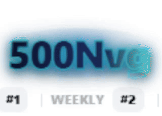
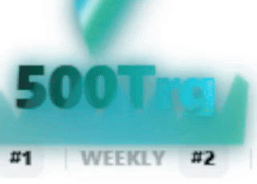
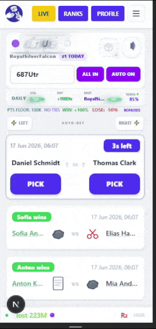
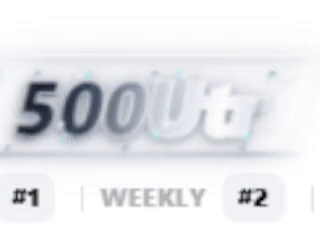
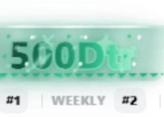
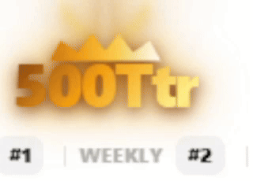
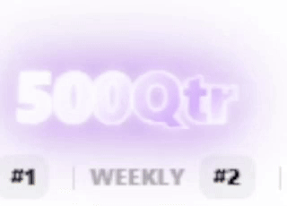
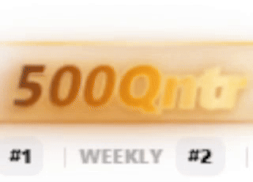
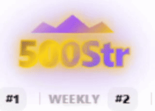

# 🪐 Global Events

A showcase of all Global Events, including their visual effects, backend synchronization mechanics, and introduced number tiers.

---

## System Rules

- **Synchronized State**: Every connected client receives the exact same event state, countdown progression, and modifier configurations from the backend.
- **Three-Phase Lifecycle**:
  - **Event Cooldown**: A randomized 7 to 12-minute quiet period after an event concludes before the next selection process starts.
  - **Warning Phase**: A 1.5 to 3-minute period alerting players of an incoming element. Warning banners render, the Oracle ticker announces the danger, and vocal alerts trigger at 60 and 30 seconds remaining.
  - **Active Phase**: A high-intensity 1 to 3-minute blitz window applying rule changes, elemental visual themes, and active interface tickers.
- **Weighted Selection**: When a cooldown concludes, the backend selects the next event using a weighted random distribution:
  - **Tidal Surge**: 30% weight
  - **Cyclone Blitz**: 25% weight
  - **Solar Flare**: 20% weight
  - **Mirage Cataclysm**: 20% weight
- **Visual Stacking**: Active Global Event visual styling applies across the entire interface, dynamically shifting card themes, particle layers, and background container glows.

---

## 🌊 Tidal Surge

An oceanic event built around crashing waves, deep currents, and hydro-telemetry effects. The interface is submerged in rich teal and emerald gradients while dynamic currents sweep behind elements.

**Effects**
- Activates the Win Echo Protocol: Every successful prediction receives an additional +20% signal payout echo
- Card visuals and UI transform to match the active element with flowing oceanic waves
- Dynamic CSS effects and live marquee telemetry update in real-time
- Voice and audio integration cues align with atmospheric warning sequences

  <strong>Tidal Surge in Action</strong> 
  

**Introduced Tiers**

| Tier | Scale | Tag | Preview | Description |
|------|-------|-----|---------|-------------|
| Novemvigintillion | 10⁹⁰ | abyssal trench / nvg |  | Deep midnight-blue typography with neon cyan outlines and sapphire glow effects. Behind the text, a pulsing abyssal aura radiates while sapphire spores continuously drift downward. |
| Trigintillion | 10⁹³ | leviathan maelstrom / trg |  | Teal and emerald gradients flow beneath animated cyan currents while a towering water vortex sways above the text. Below, a jagged tsunami crashes with animated white foam and violent wave motion. |

---

## 🌀 Cyclone Blitz

A kinetic storm event driven by atmospheric vortices, raging winds, and high-speed storm vectors. The screen is swept with heavy gale-force lines and rapid diagonal storm currents.

**Effects**
- Activates the Streak Turbocurrent: Successful predictions increase win streaks by +2 instead of +1, accelerating access to streak multipliers
- UI shifts into slate-blue and emerald gale lines with atmospheric storm styling
- Win effects replaced with high-velocity wind currents and lightning particle bursts
- Live marquee tracks the active storm metrics and turbocurrent telemetry

  <strong>Cyclone Blitz in Action</strong> 
  

**Introduced Tiers**

| Tier | Scale | Tag | Preview | Description |
|------|-------|-----|---------|-------------|
| Untrigintillion | 10⁹⁶ | gale-force aero / utr |  | Liquid platinum-silver text with left-trailing smoked-slate wind plumes, enveloped in a seamless parallax jetstream of horizontal wind threads, glowing rails, and tiny silver condensation droplets. |
| Duotrigintillion | 10⁹⁹ | razor tempest / dtr |  | Slate-and-emerald chrome text with a static 3D shadow, framed by serrated green mechanical tracks, wind threads, needle-thin vertical sparks, and floating, slowly bobbing spiky icons. |

---

## ☀️ Solar Flare

A thermal plasma event inspired by stellar eruptions, corona rings, and solar prominence. Thermal energy pulses outward as glowing particles and intense coronal ring loops rise from the interface.

**Effects**
- All successful predictions gain a 2.0x payout multiplier while active
- Card containers and text layers morph into star-white plasma states with deep lavender flares
- Expanded bloom filters and rotating lens flares activate across the client viewport
- Live telemetric warnings on the marquee indicate active coronal flare parameters

  <strong>Solar Flare in Action</strong> 
  

**Introduced Tiers**

| Tier | Scale | Tag | Preview | Description |
|------|-------|-----|---------|-------------|
| Trestrigintillion | 10¹⁰² | solar prominence / ttr |  | Golden plasma typography illuminated by a descending volumetric light cone feeding directly into a five-peak animated solar crown with intense flare pulses. |
| Quattuortrigintillion | 10¹⁰ Belg | zenith supernova / qtr |  | Star-white and lavender gradients pulse beneath rotating lens flares and dozens of glowing plasma sparks surrounded by expanding bloom effects. |

---

## 🏜️ Mirage Cataclysm

An illusion-driven desert event featuring shifting dunes, phantom echoes, sandstorms, and mirage distortion. Interface elements sway with heat haze while sandstorms sweep horizontally across the display.

**Effects**
- Activates the Variable Echo Field: Winning predictions receive an additional randomized phantom payout ranging from 15% to 50%
- UI frames distort under active heat-wave warp filters and neon-gold dust storms
- Prediction visual boundaries blur, rendering mirage drop-shadows and phantom clone elements
- Telemetry feeds monitor sandstorm blast density and phantom echo parameters

  <strong>Mirage Cataclysm in Action</strong> 
  

**Introduced Tiers**

| Tier | Scale | Tag | Preview | Description |
|------|-------|-----|---------|-------------|
| Quintrigintillion | 10¹⁰⁸ | dune illusion / qntr |  | Golden-sand gradient text with a heat-haze mirage shadow, enveloped in a seamless parallax sandstorm of rising gold dust, top/bottom glowing rails, and slowly shifting parallax desert dunes. |
| Sextrigintillion | 10¹¹¹ | phantasm core / str |  | Smoked amethyst typography beneath an elegant royal crown with animated gold-purple shimmer effects and expanding concentric shockwaves. |

---

## UI Integration

During Global Event phases, the interface undergoes several structural visual modifications:

- **Oracle Warning Ticker**: During the Warning Phase, the top ticker displays active telemetry warnings, preparing players for incoming atmospheric anomalies.
- **Global Event Marquee**: A live, scrolling marquee surfaces during the Active Phase, feeding mathematical modifiers and live event data continuously.
- **Dynamic CSS Shaders**: High-tier containers and the background canvas are overlaid with customized shaders, simulating ocean currents, solar pulses, desert sandstorms, or rapid gales.
- **Card Transformations**: Standard card frames and prediction resolution banners are styled dynamically with element-specific color matrices and themed border frames.
- **Oracle Audio Announcements**: Transition cues and high-priority spoken alerts are synthesizer-processed, vocalizing warnings at key thresholds during countdowns.