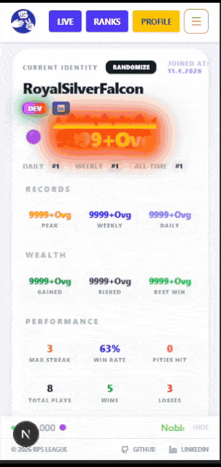
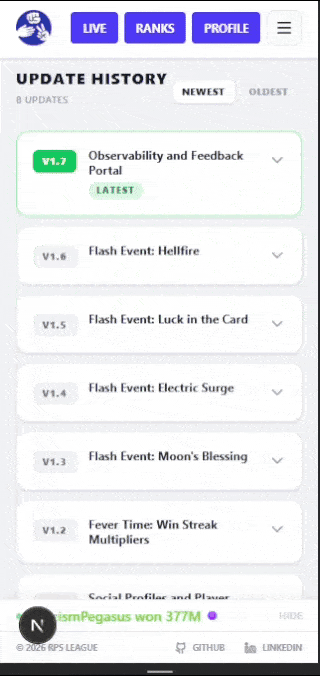
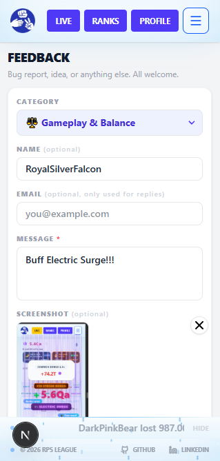
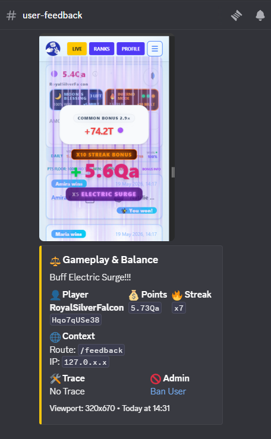
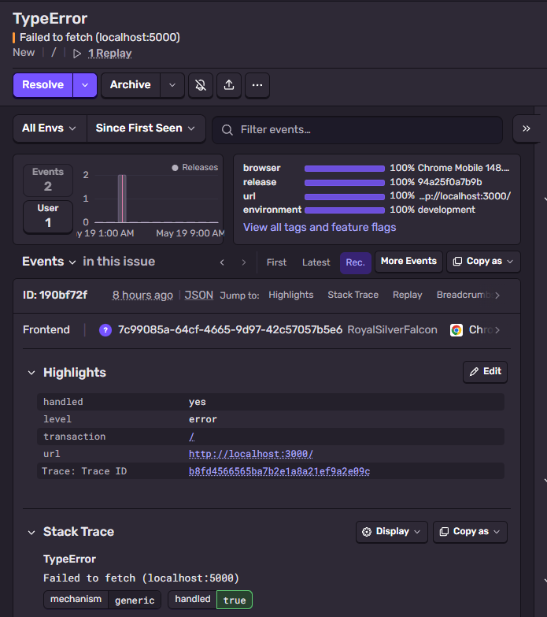
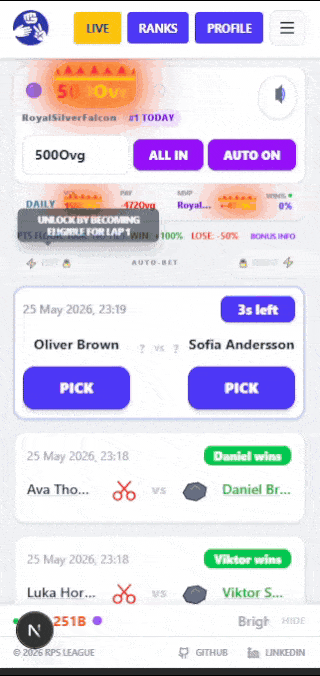

# 📹 Media Gallery

Full visual showcase of RPS League features, UI systems, and gameplay recordings.

> 📋 [View Flash Event showcase →](./EVENTS.md)

---

## 🤖 Daily Oracle & Point Style Selection

Once per day the Oracle issues a guaranteed prediction, picks a side server-side, and rigs the outcome if followed. Usage is tracked in the database so clearing browser data grants nothing. Point style selection lets players pin any visual tier they have unlocked via all-time peak.

  <strong>Daily Oracle Prophecy and Point Style Customization</strong> 
  

---

## 📋 Update History & Modal

A sorted accordion documenting all 8 versions from launch to present. Returning players see a version-aware modal on load showing exactly what changed since their last session. New players hit the welcome flow instead.

  <strong>In-app Update Log and What's New Modal</strong> 
  

---

## 🔮 Reliability & Feedback Portal

Sentry integrated across the full stack for runtime and SSE monitoring. The in-app feedback portal automatically bundles game state, environment metadata, and screenshot support. Manual reports are trace-linked directly to Sentry event IDs for instant lookup.

<table>
  <tr>
    <td></td>
    <td></td>
    <td></td>
  </tr>
</table>

---

## 🤖 Idle Auto-Bet Mode

Idle auto-betting system that automatically places your selected bet on your chosen side for every incoming match after unlock.

Unlocked after reaching Ascension (999 OVG) or starting Lap 1.

  <strong>Idle Auto-Bet Mode Showcase</strong> 
  

