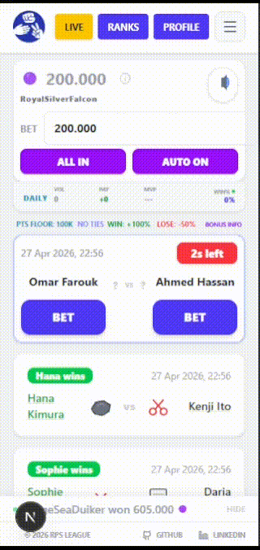

# 🎲 RPS League App

A fast-paced live-service Rock Paper Scissors league web app where players bet virtual cosmetic points on live matches, track rankings, and explore analytics.

> 🚨 **Project Evolution:** This application is a full-scale rebuilding of my original **[RPS League](https://github.com/AlexDegerman/rps-league)** (originally built for a Reaktor developer assignment). While the initial version served as a static match viewer, this version is a concurrency-aware betting engine engineered for **Infinite Scaling** and real-time user engagement.

**Live demo:** [https://rpsleaguegame.vercel.app/](https://rpsleaguegame.vercel.app/)

## 🎮 Preview

<table>
  <tr>
    <td valign="top">
      <strong>Desktop Gameplay</strong><br />
      
    </td>
    <td valign="top">
      <strong>Mobile (320px)</strong><br />
      
    </td>
  </tr>
</table>

<p><em>Showcasing selected tier colors with live transitions.</em></p>


## 📹 Media

Screenshots, gameplay recordings, and feature showcases.

📄 [View full media gallery →](./MEDIA.md)

---

## 📑 Table of Contents

- [⚡ Identity & Zero-Friction Account System](#-identity--zero-friction-account-system)
- [🕹️ Gameplay & Betting Mechanics](#️-gameplay--betting-mechanics)
- [📋 Overview](#-overview)
- [⚡ Flash Events](#-flash-events)
- [🌌 Infinite Number Scaling & Visual Tier System](#-infinite-number-scaling--visual-tier-system)
- [🔢 Global Number Formatting Engine](#-global-number-formatting-engine)
- [📊 Competitive Analytics & Profiles](#-competitive-analytics--profiles)
- [🧾 Match History Timeline](#-match-history-timeline)
- [⚡ Live Activity Feed](#-live-activity-feed)

- [🏗️ Architecture](#️-architecture)
- [🎨 Design Decisions](#-design-decisions)
- [🛠️ Technical Challenges & Solutions](#️-technical-challenges--solutions)
- [🔮 Reliability & Feedback](#-reliability--feedback)
- [🤖 AI Oracle & Analytics](#-ai-oracle--analytics)
- [📱 Mobile & PWA Experience](#-mobile--pwa-experience)

- [🧪 Tests](#-tests)
- [🚀 CI/CD & Automation](#-cicd--automation)
- [🚀 Future Improvements](#-future-improvements)

- [📦 How to Run](#-how-to-run)
- [🔌 API Reference](#-api-reference)
- [📱 Device Compatibility](#-device-compatibility)
- [⚠️ Disclaimer](#️-disclaimer)
- [🔮 Oracle Privacy & Monitoring](#-oracle-privacy--monitoring)
- [📜 License](#-license)

---

## ⚡ Identity & Zero-Friction Account System

RPS League is built for instant participation without traditional account friction. A persistent identity is automatically created on first visit, allowing users to enter the competition loop in seconds with no email or registration required.

- **Interactive Onboarding**: A Welcome Modal for first-time visitors that introduces the virtual economy and allows for immediate nickname "Rerolling" to establish identity before the first match.
- **Anonymous Persistence**: Native `localStorage` identity architecture ensures long-term session and progression continuity without a central database login.
- **Recovery-Code Restoration**: Simple alphanumeric slugs generated on the backend allowing users to securely migrate or restore profiles and statistics across different devices.
- **Hybrid Identity Layer**: Optional professional signaling using URL-validated links to display identity badges on leaderboards for social proof and fully clickable external links on public profiles.
- **Shareable Performance Dashboards**: Unique public profile URLs featuring 16 tracked data points and a context-aware match history (Recent, Biggest Wins, Best Multipliers), visualizing predictions through rich event cards that track tiered bonuses, flash event overlays, and move-set comparisons.
- **Adaptive Entry Flow**: First-time players are introduced through an interactive onboarding modal with nickname rerolling and instant identity generation, while returning users receive contextual "What's New" overlays tied to the latest acknowledged release version.
- **Client-Side Version Tracking**: Lightweight release acknowledgement system powered by `localStorage`, ensuring update notifications are only surfaced once per deployed version without requiring authentication or backend session state.
- **Integrated Update Log**: Dedicated in-app update history page documenting major gameplay systems, live-service features, infrastructure upgrades, and seasonal content rollouts.
This architecture eliminates the barrier to entry while preserving a robust layer of social identity and competitive status across the league ecosystem.

---

## 🕹️ Gameplay & Betting Mechanics

- Players bet virtual points on fast-paced Rock Paper Scissors matches
- Matches appear every 5 seconds, with a 3-second betting window
- No ties ever occur, every match always produces a clear winner to keep gameplay fast, decisive, and more exciting
- Dynamic odds:
  - **WIN:** +100% of your bet
  - **LOSE:** -50% of your bet
  - **Floor:** points never drop below 100,000
  - **Bonus System**: 40% chance per match to trigger a Tiered Bonus multiplier.
    - On Win: Multiply your payout by 2×–10× depending on tier.
    - On Loss: Reduce your loss to 60%–0% of the base loss depending on tier.
    - Tiers: Common (2–3×), Rare (3–5×), Epic (5–8×), Legendary (10×, guaranteed).
    - Guarantees a bonus at least every 4 bets if it doesn't occur naturally from the 40% base chance
- Win streak system:
  - Consecutive wins unlock escalating multipliers at 3, 4, and 5 wins (x3, x6, x10)
  - x10 multiplier persists until the streak is broken
  - Longest win streak is permanently tracked in player profiles
  - Momentum changes the UI color theme in real time as streak increases
  - Streak badge evolves visually with each tier
  - Core action buttons adapt to the active streak color state
- Points contribute to:
  - Current points
  - Weekly gains
  - All-time peak leaderboard
- Live feed shows prioritized, high-frequency results from:
  - Your own bets (instant feedback)
  - Other players
  - Demo traffic for continuous activity

---

## 📋 Overview

- High-frequency match system (5s intervals, 17,000+ daily events)
- Massive Match History: Optimized to handle and query a dataset of 10,000+ matches.
- Unified Ranking Engine: Dual leaderboards for Players and Predictors with deep-linkable URL state, supporting dynamic time-filtering (Daily/Weekly/All-Time) and multi-metric sorting (Points, Gained, Peak, Win Rate).
- AI-powered analysis using Gemini
- Full test coverage across backend services and frontend components
- Live League Insights: Live Stat Ticker showing daily betting volume, net community gains, and Daily MVP, updates every 15 seconds
- Infinite Scaling: Engineered with native BigInt support to handle astronomical point values (Sextillions, Vigintillions, and beyond).

---

## ⚡ Flash Events

Flash Events are live gameplay modifiers that can trigger during matches with a 5% chance per bet. When activated, a random event temporarily transforms the application for the next 3 predictions through:

- Full UI theme overrides  
- Custom particle systems  
- Event-specific audio design  
- Gameplay modifiers and multipliers  
- Dynamic typography and visual effects  
- Animated endgame number-tier styling  

Events are designed as evolving seasonal content and continuously expand over time.
Event selection is weighted to support controlled rollout of new or seasonal events, allowing certain events to appear more frequently without changing the global trigger rate.

> 📋 **[View all Flash Event showcases →](./EVENTS.md)**

### Featured: Moon's Blessing

A calm lunar-inspired event wrapped in cool blue tones with serene visual and audio effects.

<div>
  <strong>Moon's Blessing Flash Event in Action</strong><br/>
  
</div>

---

## 🌌 Infinite Number Scaling & Visual Tier System

RPS League is engineered around native `BigInt` progression, allowing point values to scale far beyond traditional leaderboard systems without precision loss.

Rather than stopping at millions or billions, the economy extends into astronomical numerical territory, reaching vigintillions and beyond through continuously expanding progression tiers.

Each tier carries a distinct visual identity, expressed through fully animated styling systems that evolve as players progress deeper into the scale. Higher tiers grow increasingly intense and expressive, while lower tiers stay minimal and readable for clarity.

Each major event introduces new number tiers, each styled around the theme of the event.

These tiers extend the game’s visual language through themed gradients, glow behavior, and animation logic shaped by each event’s identity.

For example, Moon’s Blessing introduces lunar glow systems, while other events explore directions such as electric storm effects or holographic styling. Over time, these systems form a growing library of distinct visual identities across the progression scale.

Progression is designed to feel increasingly unstable, excessive, and visually alive as players push deeper into astronomical point territory.

Players can pin a preferred visual style from their profile page, selecting any tier they have unlocked based on all-time peak. Auto-style mode advances the display automatically as new thresholds are reached and can be overridden at any time.

---

## 🔢 Global Number Formatting Engine

The entire economy, leaderboard system, and UI rendering pipeline is unified through a custom BigInt-first formatting engine. It acts as the single source of truth for all numeric parsing, scaling, and display logic across the application.

It handles:

- Parsing shorthand inputs into safe BigInt values across extreme scales  
- Converting raw values into tiered human-readable formats (M, B, T, up to vigintillions and beyond)
- Mapping numeric ranges directly to visual styles, gradients, and tier identities  
- Ensuring consistent formatting across across all frontend rendering contexts

Every visible number in the system flows through this engine, including:

- Leaderboards  
- Player profiles  
- Live activity feed  
- Bonus and multiplier outcomes  
- Tier-based UI transitions  

This guarantees deterministic behavior across all devices and prevents divergence between stored values and rendered output, even at extreme numerical ranges.

---

## 📊 Competitive Analytics & Profiles

Each profile surfaces 16 tracked data points, powering competitive rankings, progression tracking, and long-term performance analysis.

- **Progression Snapshot:** Joined date, longest recorded streak, and long-term peak milestones
- **Ranking Snapshot:** Live placement across Daily, Weekly, and All-Time leaderboards
- **Record Tracking:** Peak, Daily High, and Weekly High balances to reflect historical performance
- **Wealth Metrics:** Total gained, total risked, biggest single win, and multiplier-based milestones
- **Performance Stats:** Win rate, max streak, and total wins vs losses
- **Bonus Telemetry:** Pity-system triggers, multiplier outcomes, and bonus-tier history

---

## 🧾 Match History Timeline

Each player profile includes a fully interactive match history system that visualizes every prediction as a rich event card.

The history view is structured into three contextual tabs:

- **Recent** - chronological activity feed
- **Biggest Wins** - highest-value outcomes ranked
- **Best Multipliers** - peak bonus and flash event combinations

Each entry renders as a high-density match card containing outcome state, stake and gain/loss breakdown, bonus tier and multiplier effects, flash event overlays with themed styling, player move comparison with pick highlighting, and timestamped match context.

The system uses infinite scrolling with progressive loading to support large historical datasets while maintaining smooth UI performance.

All economic systems - bonus tiers, flash events, multipliers - are visually embedded directly into each match entry, turning player history into a replayable progression timeline rather than a static log.

---

## 🔴 Live Activity Feed

High-frequency, concurrency-aware event stream handling:

- Real user bets
- Global results
- Simulated demo traffic

Guarantees:
- No overlap between events
- Immediate visibility for user actions
- Continuous activity even during low traffic

---

## 🏗️ Architecture

| Layer | Stack |
|-------|-------|
| Database | Supabase PostgreSQL (Validated on 10k+ record datasets) |
| Frontend | Next.js, React, TypeScript, Tailwind CSS |
| State Management | Zustand (game, user, ui, stores)|
| Backend | Node.js, Express, TypeScript, Google Gemini API |
| Real-time | Server-Sent Events via `/api/live` |
| Database | Supabase PostgreSQL |
| Testing | Vitest, React Testing Library |
| Match system | Custom generator feeding SSE stream |

---

## 🎨 Design Decisions

- **Zero-friction onboarding**: Instant anonymous play with random nickname generation
- **SSE over WebSockets**: Chosen for simplicity, lower overhead, and better serverless compatibility
- **Concurrency-aware event stream**: Guaranteed stability and zero overlap between real user bets and demo traffic
- **Profile recovery system** for cross-device portability
- **Mock match generator** for self-contained deployment
- **Production-hardened AI**: Resilient, grounded, and rate-limited analytics engine
- **Single-tab enforcement**: BroadcastChannel detects duplicate tabs, closes the redundant SSE connection, and surfaces a non-blocking in-app notice.

---

## 🛠️ Technical Challenges & Solutions

**SSE buffering in production**
Real-time events were delayed in deployment due to proxy buffering. Solved by disabling buffering via the X-Accel-Buffering: no header, ensuring instant delivery of match results.

**High-frequency UI ticker (100,000+ daily events)**
Handling a constant stream of ~1.2 events per second (100,000+ daily) posed a risk of state thrashing and main-thread blocking. I engineered a custom event processor using React refs as a high-speed staging buffer and a 50ms interval-based update loop. By utilizing hardware-accelerated CSS (transform: translateX) and will-change: transform, the ticker maintains a smooth 60fps by offloading animations to the GPU.

**Concurrency and event prioritization**
Designed a non-blocking feed that prioritizes real user actions over simulated demo traffic. Used a weighted splice logic to ensure "Live" user bets are injected immediately into the front of the processing queue, guaranteeing zero-latency feedback for players.

**Real-Time Connection Guarding & State Monitoring**
Engineered a robust connection-state monitor to manage "stale" event streams and intermittent network drops. Implemented heartbeat tracking and active status messaging to ensure seamless UI transitions and zero-data-loss during session interruptions.

**Handling Extreme Numbers (Quadrillions → Vigintillions)**  
JavaScript Number (IEEE 754) loses integer precision beyond approximately 9 quadrillion (2⁵³−1). In a high-frequency betting system with compounding multipliers, this limit was reached quickly and began corrupting calculations across the stack.

The entire system was refactored to remove floating-point risk and enforce exact arithmetic. This included database migration of numeric fields to `NUMERIC` in PostgreSQL, backend transition to native BigInt operations in Node.js, and frontend updates to ensure safe rendering and formatting of large values.

This guarantees accurate computation, storage, and display of point values at extreme scales, including vigintillion-range totals under sustained gameplay pressure.

---

## 🔮 Reliability & Feedback

To maintain a professional live-service standard and close the loop between user experience and system logs:

- **Unified Observability**: Integrated Sentry for full-stack error tracking and performance monitoring across the entire stack, frontend React/Next.js and backend Express, specifically guarding against BigInt overflows and SSE connection failures. Structured logging captures SSE client lifecycle events (connect, disconnect, client count) and match resolution errors in real time.
- **Context-Aware Feedback**: An in-app portal for bug reports and suggestions. Submissions automatically bundle game state (points, streak, active events) and environment metadata (route, viewport, browser).
- **Trace-Link Debugging**: Manual feedback is linked directly to Sentry’s `associatedEventId`, allowing for instantaneous lookup of the exact line of code that failed during a reported user session.
- **Visual Reporting**: Support for screenshot attachments via **Multer** buffer-processing, including native clipboard paste (Ctrl+V) and drag-and-drop functionality.
- **Operational Monitoring**: Automated real-time alerts for feedback and AI Oracle queries are dispatched via **Discord Webhooks** to a private administrative channel.
- **Privacy & Security**: IP addresses are masked (e.g., `192.168.x.x`) for audit logs. No authentication tokens, passwords, or PII are ever logged or stored.

---

## 🤖 AI Oracle & Analytics
The platform features "The Oracle", a custom-tuned AI analyst powered by Google Gemini. Unlike standard chatbots, The Oracle is a domain-specific agent designed to provide snarky, data-driven insights into the RPS league.

**Key AI Features:**
- **Context-Aware Grounding**: Injects real-time league telemetry and historical data from a 10,000+ match dataset into the model context via XML-tagged data structures.
- **Resilient Model Fallback**: Rotates across gemini-2.0-flash, gemini-flash-lite, and gemini-pro to maintain uptime during 503/429 errors.
- **Intent Guardrailing**: Strict system instructions prevent hallucinations or off-topic queries. Refuses non-RPS topics, maintaining persona and reducing token costs.
- **Performance Optimization**: In-memory TTL cache and IP-based rate limiting to prevent abuse and minimize latency.
- **Strategic Analytical Presets**: Includes a curated set of “one-tap” queries designed to reveal hidden league patterns. These presets guide users in exploring underlying PostgreSQL telemetry, such as move frequency heatmaps and real-time house edge, transforming raw data into actionable betting insights.
- **Daily Oracle Prophecy**: Once per day, the Oracle issues a guaranteed match prediction. It picks a side server-side and rigs the outcome in the player's favor if followed. Usage is tracked in the database per user, not localStorage, making it tamper-proof. Resets at midnight UTC.

<p><em>Showcasing AI Analysis.</em></p>


---

## 📱 Mobile & PWA Experience

RPS League is designed with a mobile-first approach, leveraging modern PWA standards to deliver a fast, app-like experience across devices.

- **Adaptive Leaderboard Architecture**: On smaller screens, the leaderboard dynamically pivots from a wide table into a specialized 14-column grid. This ensures high-density data such as Wins, Losses, Points, and Peak Performance remains perfectly aligned and readable without horizontal scrolling.

- **PWA Install Experience**: Configured via `manifest` and Next.js Metadata API, enabling installable app behavior on mobile and desktop. Includes optimized icons and rich metadata for a polished, native-like installation prompt.

- **Native-Feel Interactions**: Touch-friendly UI with optimized tap targets for betting actions (e.g., "ALL IN") and a real-time live feed that prepends new matches instantly, designed for seamless thumb-based navigation.

- **Mobile Profile UI**: Player profiles are fully optimized for small screens, using a compact card-based layout to surface identity, rankings, records, and performance stats without clutter. High-contrast metrics and grouped sections ensure fast readability during live play.

---

## 🧪 Tests

**Backend (Vitest)**
- **Analysis Route**: Verifies model fallback rotation, caching, and rate limiting to ensure API stability.
- **Leaderboard Service**: Tests SQL aggregations including win ranking, alphabetical tiebreaking, and date range padding.
- **Match Service**: Validates deterministic winner logic, pagination offsets, and player stat aggregation.
- **Prediction Service**: Ensures correct bet validation, win/loss point calculations, 100k floor enforcement, and secure recovery code formatting.

**Frontend (Vitest + React Testing Library)**
- **PendingMatchCard**: Confirms correct player rendering, interactive bet button states, and countdown timer accuracy.
- **HomePage**: Tests core betting loop ("ALL IN", floor clamping, AUTO toggle), user store integration (nickname display, bet amount sync), and live connection state rendering.
- **Leaderboard Page**: Verifies default tab states, URL-synchronized tab switching, and empty state handling for new players.

---

## 🚀 CI/CD & Automation

The RPS League stack is fully automated via **GitHub Actions** to manage testing, deployment, and high-frequency maintenance.

### Pipeline Overview

| Stage | Tool | Purpose |
| :--- | :--- | :--- |
| **Testing** | Vitest | ~28s suites for Betting Loops & API logic |
| **Deployment** | Vercel / Render | Zero-touch CD after passing CI |
| **Maintenance** | Cron Jobs | Daily/Weekly leaderboard resets + Oracle prophecy reset |

### Key Workflows

- **Leaderboard Engine:** Automated `POST` to `/api/predictions/reset` keeps `daily_peak` and `weekly_peak` accurate.
- **Oracle Reset:** Automated `POST` to `/api/oracle/reset` at 00:01 UTC daily generates a fresh prophecy side and clears all per-user usage state. Reuses `RESET_SECRET` for authorization. Supports manual dispatch for testing.
- **Vercel Deployment Check:** Dispatches status updates to ensure only successful builds reach production.
- **Environment Parity:** Validates `RESET_SECRET` and `DATABASE_URL` across Dev/Staging/Prod to prevent misconfigurations.

---

## 🚀 Future Improvements

* **Multi-Tiered League Layers:** A structured progression system with multiple leaderboard brackets tailored to different point thresholds, ensuring players at all stages have a relevant, competitive space to climb before hitting the main vigintillion-scale rankings.
* **Custom Cosmetic Marketplace:** A dedicated points-based store allowing players to purchase and equip various profile customizations, such as unique leaderboard card backgrounds, exclusive text neon shimmers, custom tier badges, and premium name colors, without diluting the prestige of event-exclusive victory animations.
* **Social Group Hubs:** Custom, isolated group and friend leaderboards designed to foster close-knit, high-frequency competition outside the global ecosystem.
* **Unified OAuth Integration:** Optional Google Authentication built into the profile settings to streamline secure profile recovery alongside the existing short-ID architecture.

---

## 📦 How to Run
```bash
git clone https://github.com/AlexDegerman/rps-league-app.git
cd rps-league-app
```

**Backend**
```bash
cd backend
cp .env.example .env
npm install
npm run dev
```

**Frontend**
```bash
cd frontend
cp .env.local.example .env.local
npm install
npm run dev
```

Open http://localhost:3000

---

## 🔌 API Reference

Full API documentation for RPS League is available in a dedicated file covering all endpoints, database schema, and environment configuration.

📄 [View API Documentation](./api.md)

---

## 📱 Device Compatibility

This application uses native BigInt to handle extremely large point values without precision loss, scaling into the vigintillions during extended gameplay.

- Supported: Modern mobile and desktop browsers (iOS 14+, Android 9+, Chrome, Firefox, Safari)  
- Not supported: Older browsers and devices without BigInt support, such as Internet Explorer and early iPhone models (iPhone 6 and 7)

This ensures consistent leaderboard accuracy and stable gameplay across supported platforms.

---

## ⚠️ Disclaimer

RPS League is a virtual points-based game experience.

All points, multipliers, and rewards are purely cosmetic and hold no monetary value.  
No real-money gambling, cash payouts, or withdrawable rewards are supported.

---

## 🔮 Oracle Privacy & Monitoring
To maintain system stability and fine-tune AI behavior, anonymized queries are logged to a private administrative audit channel.
- **Privacy**: IP addresses are masked (e.g., `192.168.x.x`). 
- **Security**: No authentication tokens, passwords, or personally identifiable information are logged or stored
- **Observability**: Enables real-time monitoring of model behavior, including hallucinations and edge-case detection during live matches

---

## 📜 License

This project is proprietary software.

Source code is not licensed for public reuse, modification, or distribution.