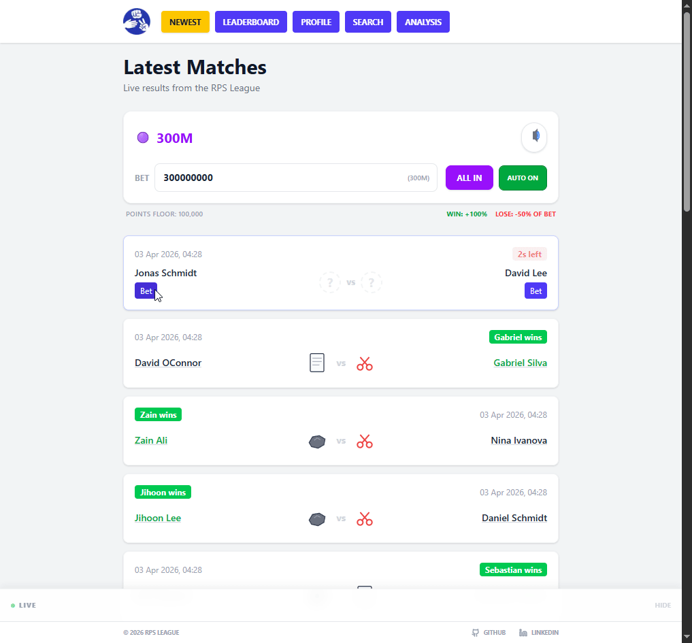

# RPS League App

A fast-paced Rock Paper Scissors league web app where players bet virtual cosmetic points on live matches, track rankings, and explore analytics.

Originally built as a summer dev assignment for Reaktor as a simple match viewer, now rebuilt into a full real-time betting and analysis platform.

**Live demo:** https://rpsleaguegame.vercel.app/



---

## Gameplay & Betting Mechanics

- Players bet virtual points on fast-paced Rock Paper Scissors matches
- Matches appear every 5 seconds, with a 3-second betting window
- Dynamic odds:
  - **WIN:** +100% of your bet
  - **LOSE:** -50% of your bet
  - **Floor:** points never drop below 100,000
- Points contribute to:
  - Current points
  - Weekly gains
  - All-time peak leaderboard
- Live feed shows prioritized, high-frequency results from:
  - Your own bets (instant feedback)
  - Other players
  - Demo traffic for continuous activity
- Zero-friction onboarding with instant anonymous play (random nickname, no login)

---

## Overview

- High-frequency match system (5s intervals, 17,000+ daily events)
- Instant user creation with persistent ID and nickname
- Massive Match History: Optimized to handle and query a dataset of 10,000+ matches.
- Unified Ranking Engine: Dual leaderboards for Players and Predictors with deep-linkable URL state, supporting dynamic time-filtering (Daily/Weekly/All-Time) and multi-metric sorting (Points, Gained, Peak, Win Rate).
- Player profiles with nickname randomization and recovery codes
- AI-powered analysis using Gemini
- Full test coverage across backend services and frontend components
- Live League Insights: Live Stat Ticker showing daily betting volume, net community gains, and Daily MVP, updates every 15 seconds

---

## Live Activity Feed

High-frequency, concurrency-aware event stream handling:

- Real user bets
- Global results
- Simulated demo traffic

Guarantees:
- No overlap between events
- Immediate visibility for user actions
- Continuous activity even during low traffic

---

## Architecture

| Layer | Stack |
|-------|-------|
| Database | Supabase PostgreSQL (Validated on 10k+ record datasets) |
| Frontend | Next.js, React, TypeScript, Tailwind CSS |
| Backend | Node.js, Express, TypeScript, Google Gemini API |
| Real-time | Server-Sent Events via `/api/live` |
| Database | Supabase PostgreSQL |
| Testing | Vitest, React Testing Library |
| Match system | Custom generator feeding SSE stream |

## Technical Challenges & Solutions

**SSE buffering in production**
Real-time events were delayed in deployment due to proxy buffering. Solved by disabling buffering via the X-Accel-Buffering: no header, ensuring instant delivery of match results.

**High-frequency UI ticker (100,000+ daily events)**
Handling a constant stream of ~1.2 events per second (100,000+ daily) posed a risk of state thrashing and main-thread blocking. I engineered a custom event processor using React refs as a high-speed staging buffer and a 50ms interval-based update loop. By utilizing hardware-accelerated CSS (transform: translateX) and will-change: transform, the ticker maintains a smooth 60fps by offloading animations to the GPU.

**Concurrency and event prioritization**
Designed a non-blocking feed that prioritizes real user actions over simulated demo traffic. Used a weighted splice logic to ensure "Live" user bets are injected immediately into the front of the processing queue, guaranteeing zero-latency feedback for players.

**Cold start resilience & Connection Guarding**
Engineered a connection-state monitor that detects backend cold starts and "stale" event streams. Replaces empty UI states with active status messaging and heartbeat tracking, ensuring the user is informed during server spin-up or network drops.

---

## AI Oracle & Analytics
The platform features "The Oracle", a custom-tuned AI analyst powered by Google Gemini. Unlike standard chatbots, The Oracle is a domain-specific agent designed to provide snarky, data-driven insights into the RPS league.

**Key AI Features:**
- **Context-Aware Grounding**: Injects real-time league telemetry and historical data from a 10,000+ match dataset into the model context via XML-tagged data structures.
- **Resilient Model Fallback**: Rotates across gemini-2.0-flash, gemini-flash-lite, and gemini-pro to maintain uptime during 503/429 errors.
- **Intent Guardrailing**: Strict system instructions prevent hallucinations or off-topic queries. Refuses non-RPS topics, maintaining persona and reducing token costs.
- **Performance Optimization**: In-memory TTL cache and IP-based rate limiting to prevent abuse and minimize latency.
- **Strategic Analytical Presets**: Includes a curated set of “one-tap” queries designed to reveal hidden league patterns. These presets guide users in exploring underlying PostgreSQL telemetry, such as move frequency heatmaps and real-time house edge, transforming raw data into actionable betting insights.

---

## Tests

**Backend (Vitest)**
- **Analysis Route**: Verifies model fallback rotation, caching, and rate limiting to ensure API stability.
- **Leaderboard Service**: Tests SQL aggregations including win ranking, alphabetical tiebreaking, and date range padding.
- **Match Service**: Validates deterministic winner logic, pagination offsets, and player stat aggregation.
- **Prediction Service**: Ensures correct bet validation, win/loss point calculations, 100k floor enforcement, and secure recovery code formatting.

**Frontend (Vitest + React Testing Library)**
- **PendingMatchCard**: Confirms correct player rendering, interactive bet button states, and countdown timer accuracy.
- **HomePage**: Tests core betting loop, "ALL IN" button logic, Auto All-In state persistence, and hydration-safe points display.
- **Leaderboard Page**: Verifies default tab states, URL-synchronized tab switching, and empty state handling for new players.

---

## Design Decisions

- **Zero-friction onboarding**: Instant anonymous play with random nickname generation
- **SSE over WebSockets**: Chosen for simplicity, lower overhead, and better serverless compatibility
- **Concurrency-aware event stream**: Guaranteed stability and zero overlap between real user bets and demo traffic
- **Profile recovery system** for cross-device portability
- **Mock match generator** for self-contained deployment
- **Production-hardened AI**: Resilient, grounded, and rate-limited analytics engine

---

## Future Improvements

- Friends system with social leaderboard
- Player vs player head-to-head statistics
- Dynamic Risk & Multiplier Engine: Asymmetric betting system with “Flash Events” with increased gain and loss rates to enhance strategic depth.
- Deeper AI-driven insights and trend detection
- Cosmetic Prestige System: Spend earned points on profile customizations, including unique name colors, tiered badges, and exclusive icon sets to stand out on the leaderboards.

---

## API Endpoints

| Method | Endpoint | Description |
|--------|----------|-------------|
| GET | `/api/live` | SSE stream for live events |
| GET | `/api/matches` | Paginated match history |
| GET | `/api/matches/pending` | Active pending match |
| GET | `/api/matches/by-date` | Matches by date |
| GET | `/api/matches/by-player` | Matches by player |
| GET | `/api/matches/players` | All unique player names |
| GET | `/api/matches/players/:name/stats` | Player career stats |
| GET | `/api/leaderboard/historical` | Historical player leaderboard |
| GET | `/api/leaderboard/today` | Today's player leaderboard |
| GET | `/api/predictions/leaderboard/unified?tab=[period]&sort=[metric]` | Unified predictor leaderboard with dynamic time filters and sortable performance metrics |
| POST | `/api/predictions` | Submit a prediction |
| GET | `/api/predictions/:userId/points` | User points and peak |
| GET | `/api/predictions/:userId/stats` | User prediction stats |
| GET | `/api/predictions/recovery/:userId` | Get recovery code |
| POST | `/api/predictions/recover` | Recover profile by code |
| GET | `/api/predictions/stats` | Platform stats |
| GET | `/api/predictions/stats/daily` | Daily betting stats and MVP |
| POST | `/api/analysis` | AI Oracle query (Gemini) |

---

## Environment Variables
Frontend (`/frontend/.env.local`)
```bash
NEXT_PUBLIC_API_URL=http://localhost:5000
```
Backend (`/backend/.env`)
```bash
# Database & Security
DATABASE_URL=your_supabase_connection_string
CORS_ORIGIN=http://localhost:3000

# Infrastructure Automation
# Secret key for GitHub Actions reset workflows
RESET_SECRET=your_long_random_secret

# AI Integration
GEMINI_API_KEY=your_gemini_api_key

# Observability (Optional)
# Leave blank to disable administrative audit logging
DISCORD_LOG_WEBHOOK=your_discord_webhook_url
```
---

## How to Run
```bash
git clone https://github.com/AlexDegerman/rps-league-app.git
cd rps-league-app
```

**Backend**
```bash
cd backend
cp .env.example .env
npm install
npm run dev
```

**Frontend**
```bash
cd frontend
cp .env.local.example .env.local
npm install
npm run dev
```

Open http://localhost:3000

---
# 🗄️ Database Schema

This project uses **Supabase PostgreSQL** to manage real-time betting, match history, and global leaderboards. The schema is optimized for high-frequency writes and real-time state synchronization.

---

### `matches`

The source of truth for the league's match history. Each row represents a completed match.

| Column | Type | Description |
| :--- | :--- | :--- |
| **game_id** (PK) | TEXT | Unique UUID v4 for the match |
| **type** | TEXT | Event discriminator (hardcoded as `GAME_RESULT`) |
| **time** | BIGINT | Unix timestamp (ms) of match creation |
| **expires_at** | BIGINT | End of 3-second betting window (start + duration) |
| **player_a_name** | TEXT | Name of the first competitor |
| **player_a_played** | TEXT | Move: `ROCK`, `PAPER`, or `SCISSORS` |
| **player_b_name** | TEXT | Name of the second competitor |
| **player_b_played** | TEXT | Move: `ROCK`, `PAPER`, or `SCISSORS` |

---

### `users`

Global user profiles with persistent point tracking and account recovery logic.

| Column | Type | Description |
| :--- | :--- | :--- |
| **user_id** (PK) | TEXT | Unique persistent identifier |
| **points** | BIGINT | Current balance (**100,000 floor enforced**) |
| **peak_points** | BIGINT | All-time highest balance achieved |
| **daily_peak** | BIGINT | Highest balance today (reset via GitHub Cron) |
| **weekly_peak** | BIGINT | Highest balance this week (reset via GitHub Cron) |
| **nickname** | TEXT | Auto-generated display name (adjective + color + animal). Users can randomize to a new combination. |
| **recovery_code** | TEXT | Unique slug (e.g., `swift-tiger-1234`) |

---

### `predictions`

Tracks all user wagers. Composite constraints prevent multiple bets on the same game.

| Column | Type | Description |
| :--- | :--- | :--- |
| **id** (PK) | SERIAL | Internal unique incrementing ID |
| **user_id** | TEXT | Bettor ID (references `users.user_id`) |
| **game_id** | TEXT | Match ID (references `matches.game_id`) |
| **pick** | TEXT | Chosen winner (`Player A` or `Player B`) |
| **bet_amount** | BIGINT | Points wagered |
| **result** | TEXT | Outcome: `WIN`, `LOSE`, or `NULL` (if pending) |
| **gain_loss** | BIGINT | Net change (Win: +100% / Loss: -50% of bet) |
| **created_at** | BIGINT | Timestamp for volume and daily stats |

---

**Relationships:**

- `predictions.user_id` → `users.user_id`  
- `predictions.game_id` → `matches.game_id`

---

## ⚠️ Disclaimer

This project is a non-commercial portfolio piece created for educational purposes.  
All points are strictly virtual and have no real-world value.  
No real-money gambling or payouts are offered.

---

## 🔮 Oracle Privacy & Monitoring
To maintain system stability and fine-tune AI behavior, anonymized queries are logged to a private administrative audit channel.
- **Privacy**: IP addresses are masked (e.g., `192.168.x.x`). 
- **Security**: No authentication tokens, passwords, or personally identifiable information are logged or stored
- **Observability**: Enables real-time monitoring of model behavior, including hallucinations and edge-case detection during live matches