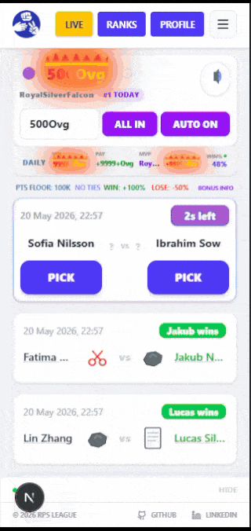
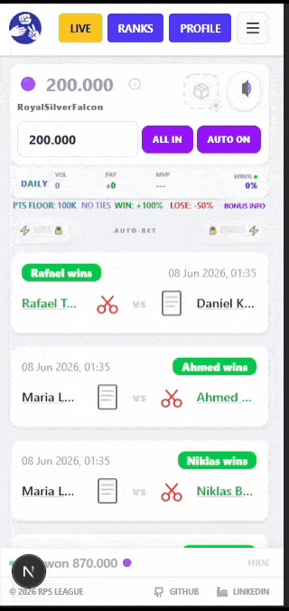
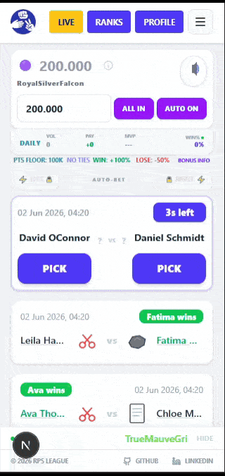
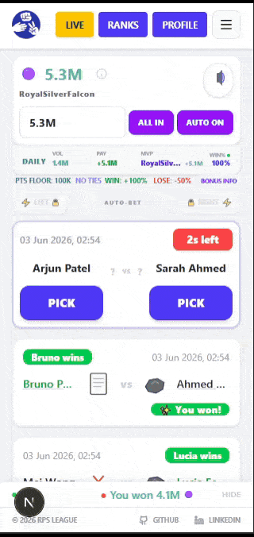
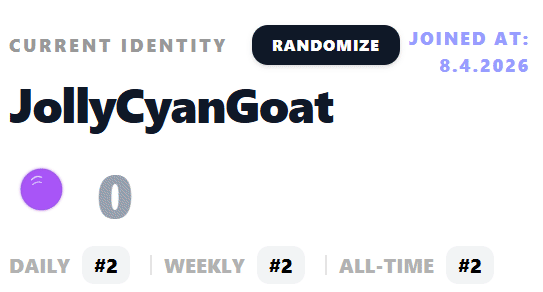
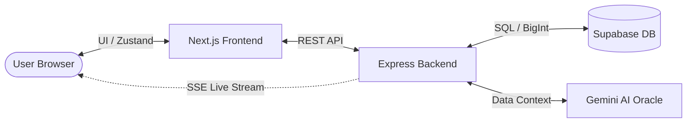
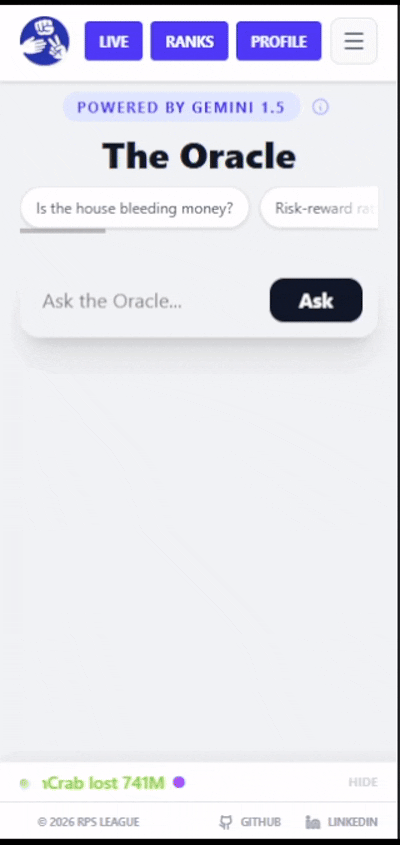
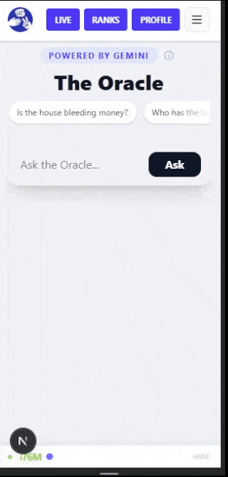
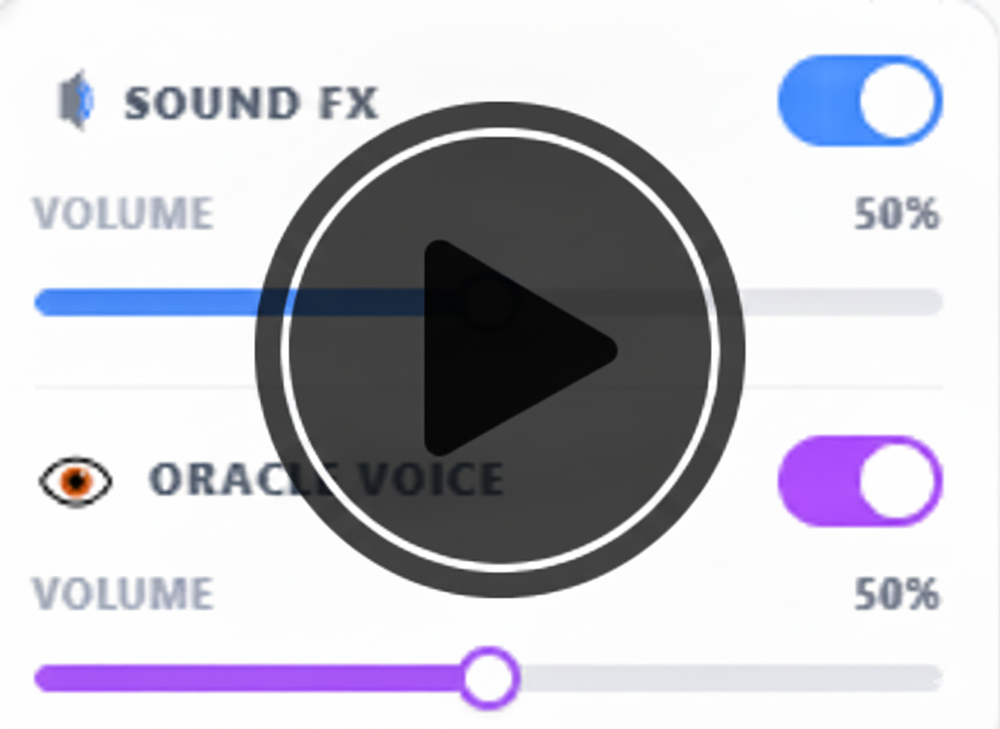

# 🎲 RPS League App

A fast-paced live-service Rock Paper Scissors league web app where players bet virtual cosmetic points on live matches, track rankings, and explore analytics.

> 🚨 **Project Evolution:** This application is a full-scale rebuilding of my original **[RPS League](https://github.com/AlexDegerman/rps-league)** (originally built for a Reaktor developer assignment). While the initial version served as a static match viewer, this version is a concurrency-aware betting engine engineered for **Infinite Scaling** and real-time user engagement.

**Play here:** [https://rpsleaguegame.fi/](https://rpsleague.fi/?utm_source=github/)

## 🎮 Preview

<p align="center">
  <em><strong>Global Events Showcase</strong>: Server-wide real-time events that transform gameplay and visuals.</em>
  <br />
  
  <br />
  <a href="https://www.youtube.com/shorts/nARfsfyWoDc">Watch full quality video</a>
</p>

<p align="center">
  <em><strong>Flash Event Activations</strong>: Personal dynamic events that temporarily override UI, audio, and outcomes.</em>
  <br />
  
  <br />
  <a href="https://www.youtube.com/shorts/cM0UDeg6uz0">Watch full quality video</a>
</p>

<p align="center">
  <em><strong>Season 2 Tier Progression</strong>: Visual scaling system where score styling evolves across extreme number tiers.</em>
  <br />
  
  <br />
  <a href="https://www.youtube.com/watch?v=4dwtzrzaOAA">Watch full quality video</a>
</p>

---

## 📑 Table of Contents

- [⚡ Identity & Zero-Friction Account System](#-identity--zero-friction-account-system)
- [🕹️ Gameplay & Betting Mechanics](#️-gameplay--betting-mechanics)
- [📋 Overview](#-overview)
- [⚡ Ascension System](#-ascension-system)
- [🧿 Relic System](#-relic-system)
- [🪐 Global Events](#-global-events)
- [🌠 Flash Events](#-flash-events)
- [👁️ Player Festivals](#️-player-festivals)
- [🏆 Predictor Achievements](#-predictor-achievements)
- [🌌 Infinite Number Scaling & Visual Tier System](#-infinite-number-scaling--visual-tier-system)
- [🔢 Global Number Formatting Engine](#-global-number-formatting-engine)
- [📊 Competitive Analytics & Profiles](#-competitive-analytics--profiles)
- [🧾 Match History Timeline](#-match-history-timeline)
- [⚡ Live Activity Feed](#-live-activity-feed)

- [🏗️ Architecture](#️-architecture)
- [🎨 Design Decisions](#-design-decisions)
- [🛠️ Technical Challenges & Solutions](#️-technical-challenges--solutions)
- [🔮 Reliability & Feedback](#-reliability--feedback)
- [🤖 AI Oracle & Analytics](#-ai-oracle--analytics)
- [🔊 Oracle Voice](#-oracle-voice)
- [📺 Extended Media Showcases](#-extended-media-showcases)
- [📱 Mobile & PWA Experience](#-mobile--pwa-experience)

- [🧪 Tests](#-tests)
- [🚀 CI/CD & Automation](#-cicd--automation)
- [🚀 Future Improvements](#-future-improvements)
- [📦 How to Run](#-how-to-run)
- [🔌 API Reference](#-api-reference)
- [📱 Device Compatibility](#-device-compatibility)
- [⚠️ Disclaimer](#️-disclaimer)
- [🔒 Privacy, Telemetry & Audit Logs](#-privacy-telemetry--audit-logs)
- [📜 License](#-license)

---

## ⚡ Identity & Zero-Friction Account System

RPS League is built for instant participation without traditional account friction. A persistent identity is automatically created on first visit, allowing users to enter the competition loop in seconds with no email or registration required.

- **Interactive Onboarding**: A Welcome Modal for first-time visitors that introduces the virtual economy and allows for immediate nickname "Rerolling" to establish identity before the first match.
- **Anonymous Persistence**: Native `localStorage` identity architecture ensures long-term session and progression continuity without a central database login.
- **Recovery-Code Restoration**: Simple alphanumeric slugs generated on the backend allowing users to securely migrate or restore profiles and statistics across different devices.
- **Guided Recovery Onboarding**: A one-time, server-persisted tutorial that triggers on the first profile visit. It utilizes a dynamic spotlight overlay and auto-scroll logic to ensure players acknowledge and secure their recovery codes, preventing permanent data loss.
- **Hybrid Identity Layer**: Optional professional signaling using URL-validated links to display identity badges on leaderboards for social proof and fully clickable external links on public profiles.
- **Shareable Performance Dashboards**: Unique public profile URLs featuring 16 tracked data points and a context-aware match history (Recent, Biggest Wins, Best Multipliers), visualizing predictions through rich event cards that track tiered bonuses, flash event overlays, and move-set comparisons.
- **Adaptive Entry Flow**: First-time players are introduced through an interactive onboarding modal with nickname rerolling and instant identity generation, while returning users receive contextual "What's New" overlays tied to the latest acknowledged release version.
- **Client-Side Version Tracking**: Lightweight release acknowledgement system powered by `localStorage`, ensuring update notifications are only surfaced once per deployed version without requiring authentication or backend session state.
- **Integrated Update Log**: Dedicated in-app update history page documenting major gameplay systems, live-service features, infrastructure upgrades, and seasonal content rollouts.
This architecture eliminates the barrier to entry while preserving a robust layer of social identity and competitive status across the league ecosystem.

---

## 🕹️ Gameplay & Betting Mechanics

- Players bet virtual points on fast-paced Rock Paper Scissors matches
- Matches appear every 5 seconds, with a 3-second betting window
- No ties ever occur, every match always produces a clear winner to keep gameplay fast and decisive

### Dynamic odds
- WIN: +100% of your bet
- LOSE: -50% of your bet
- Floor: points never drop below 100,000

### Bonus system
- 40% chance per match to trigger a Tiered Bonus multiplier
- On win: multiplies payout by 1.5x-7x depending on tier
- On loss: reduces loss to 75%-0% depending on tier (Legendary+ fully negates loss)
- Tiers:
  - Common: 1.5x-2.2x
  - Rare: 2.2x-3.2x
  - Epic: 3.2x-4.2x
  - Legendary: 5x
  - Mythical: 7x
- Guarantees at least one bonus every 4 matches if not triggered naturally

### Win streak system
- Consecutive wins unlock escalating multipliers at 3, 4, and 5 wins (x2, x3, x5)
- x5 multiplier persists until the streak is broken
- Longest win streak is permanently tracked in player profiles
- Momentum changes the UI color theme in real time as streak increases
- Streak badge evolves visually with each tier
- Core action buttons adapt to the active streak color state

### Idle auto-bet mode
- Unlocks after reaching Ascension (999 STR) or starting Lap 1
- Two tick boxes appear above each live match card: Auto-Bet Left and Auto-Bet Right
- Automatically places your selected bet on your chosen side for every incoming match after unlock
- Switching sides takes effect on the next match
- Pauses automatically when the tab is hidden or browser is minimized

### Progression & leaderboard
- Weekly gains contribute to weekly leaderboard rankings
- Peak point value determines all-time leaderboard position
- Laps track long-term progression and Ascension cycles, and are ranked in dedicated lap leaderboards
- Speedrun leaderboards track fastest Ascension cycles based on completion efficiency
- Points are continuously updated through live matches and modified by events, streaks, bonuses, and other gameplay systems

### Live feed
- Displays high-frequency match results in real time:
  - Your bets (instant feedback)
  - Other players
  - Demo traffic for continuous activity

---

## 📋 Overview

- High-frequency match system (5s intervals, 17,000+ daily events)
- Massive Match History: Optimized to handle and query a dataset of 10,000+ matches.
- Unified Ranking Engine: Dual leaderboards for Players and Predictors with deep-linkable URL state, supporting dynamic time-filtering (Daily/Weekly/All-Time) and multi-metric sorting (Points, Gained, Peak, Win Rate).
- AI-powered analysis using Gemini
- Full test coverage across backend services and frontend components
- Live League Insights: Live Stat Ticker showing daily betting volume, net community gains, and Daily MVP, updates every 15 seconds
- Infinite Scaling: Engineered with native BigInt support to handle astronomical point values (Sextillions, Vigintillions, and beyond).
- Cinematic Spectacle Orchestration: A priority-driven UI engine that sequences Flash Events, Ascensions, and Relics into a seamless flow, preventing interface exhaustion during high-frequency match cycles.

---

## ⚡ Ascension System

Upon reaching **999 STR (Sextrigintillion)**, players unlock the Ascension system: a permanent progression layer built around prestige resets and long-term mastery.

### 🏁 Chrono Laps

Reset your current balance back to **200,000 points** to permanently increase your **Lap Count**.

Each lap tracks:
- total bets taken
- lap completion speed

Compete on dedicated:
- Lap leaderboards
- Speedrun leaderboards

### ♾️ Infinite Path

Players are never forced to prestige.

Declining Ascension allows you to:
- preserve your current balance
- continue pushing toward extreme high-score tiers
- compete for permanent wealth rankings

Ascension can always be triggered later from the profile menu.

### 🎨 Persistent Mastery

Resets are visual-friendly. Any previously unlocked point-tier stylings (UVG, DVG, QIV, etc.) remain permanently available in your profile settings, allowing you to flex high-tier visuals even at the start of a fresh lap.

<p align="center">
  <strong>Ascension System Demo</strong><br/>
  
</p>

---

# 🧿 Relic System

Relics are permanent collectible gameplay modifiers that introduce long-term progression and strategic specialization. Players discover relics through a single-roll cumulative loot table spanning five rarity tiers (Common through Mythical), and each relic can only be collected once.

Each relic meaningfully alters prediction strategy, event behavior, or multiplier scaling, creating distinct build paths and playstyles. Players may equip one active relic at a time, while permanent duplicate protection turns collection into long-term progression rather than repetitive RNG farming.

<p align="center">
  <strong>Relic Discovery & Equipment in Action</strong><br/>
  
</p>

> 📋 **[View full Relic system breakdown →](./RELICS.md)**

---

## 🪐 Global Events

Global Events introduce a server-wide synchronized event loop to RPS League. Scheduled entirely on the backend and broadcast in real-time via Server-Sent Events (SSE), these events temporarily warp gameplay modifiers, transform UI card structures, and trigger dynamic CSS canvas shaders for every active player session simultaneously.

Each event includes:
- Server-wide real-time SSE synchronization 
- Structured three-phase lifecycle progression (Cooldown, Warning, and Active)
- Custom Oracle telemetry warnings and synthesized spoken countdown alerts
- Specialized visual transformations and animated number-tier scaling

Selectable events are weighted randomly, featuring **Tidal Surge** (incorporating the +20% Win Echo Protocol), **Cyclone Blitz**, **Solar Flare**, and **Mirage Cataclysm**.

> 📋 **[View all Global Event showcases →](./GLOBALEVENTS.md)**

### Featured Showcase: Tidal Surge

An oceanic-themed event built around crashing waves, deep currents, and hydro-telemetry effects that activates the Win Echo Protocol, applying a +20% signal echo to all successful predictions.

<p align="center">
  <strong>GLobal Event Trigger Animations</strong><br/>
  
</p>

---

## ⚡ Flash Events

Flash Events are live gameplay modifiers that can trigger during matches with a 5% chance per bet. When activated, a random event temporarily transforms the application for the next 3 predictions through:

- Full UI theme overrides  
- Custom particle systems  
- Event-specific audio design  
- Gameplay modifiers and multipliers  
- Dynamic typography and visual effects  
- Animated endgame number-tier styling  

Events are designed as evolving seasonal content and continuously expand over time.
Event selection is weighted to support controlled rollout of new or seasonal events, allowing certain events to appear more frequently without changing the global trigger rate.

> 📋 **[View all Flash Event showcases →](./FLASHEVENTS.md)**

### Flash Event Animations

A preview of the animations that play when flash events are triggered.

<p align="center">
  <strong>Flash Event Trigger Animations</strong><br/>
  
</p>

---

## 👁️ Player Festivals

Festivals are rare, globally-triggered gameplay events initiated by specific player actions. Unlike Flash Events, Festivals affect all active players simultaneously and are driven by emergent in-game milestones such as win streaks, loss streaks, high multipliers, and Chrono-Lap completions.

Only one Festival can be active at a time. A 10-minute cooldown follows every Festival. The triggering player's name is broadcast to all active players via the Oracle ticker when a Festival activates.

The Oracle system also runs autonomous weighted festivals during low-concurrency periods, simulating world activity when no player-triggered festival has occurred recently.

<p align="center">
  <strong>Ghost Festival in Action</strong><br/>
  
</p>

> 📋 **[View all Festival showcases →](./FESTIVALS.md)**

---

## 🏆 Predictor Achievements

The Achievement Codex is a multi-tier progression system tracking over 100 unique simulation milestones. Unlocking these milestones awards collectible badges, each dynamically styled with distinct borders, glowing text, and custom animated aura effects that scale based on the achievement's rarity tier (spanning from Common up to Mythical and Rainbow).

Earned badges feature dynamic upgrading: unlocking a higher-rarity achievement automatically replaces lower-tier versions in your collection to keep your inventory clean. Predictors can manually curate their Top 5 badges to showcase on their public profile and global leaderboards, or toggle **Auto-Equip** to dynamically display their rarest badges in real-time with randomized tie-breakers.

<p align="center">
  <strong>Achievements System in Action</strong><br/>
  
</p>

> 📖 **[View the full Achievement Codex →](./ACHIEVEMENTS.md)**

---

## 🌌 Infinite Number Scaling & Visual Tier System

RPS League is engineered around native `BigInt` progression, allowing point values to scale far beyond traditional leaderboard systems without precision loss.

Rather than stopping at millions or billions, the economy extends into astronomical numerical territory, reaching vigintillions and beyond through continuously expanding progression tiers.

Each tier carries a distinct visual identity, expressed through fully animated styling systems that evolve as players progress deeper into the scale. Higher tiers grow increasingly intense and expressive, while lower tiers stay minimal and readable for clarity.

Each major event introduces new number tiers, each styled around the theme of the event.

These tiers extend the game’s visual language through themed gradients, glow behavior, and animation logic shaped by each event’s identity.

For example, Moon’s Blessing introduces lunar glow systems, while other events explore directions such as electric storm effects or holographic styling. Over time, these systems form a growing library of distinct visual identities across the progression scale.

Progression is designed to feel increasingly unstable, excessive, and visually alive as players push deeper into astronomical point territory.

Players can pin a preferred visual style from their profile page, selecting any tier they have unlocked based on all-time peak. Auto-style mode advances the display automatically as new thresholds are reached and can be overridden at any time.

<p align="center">
  <em>Showcasing selected tier colors with live transitions.</em><br/>
  
</p>

---

## 🔢 Global Number Formatting Engine

The entire economy, leaderboard system, and UI rendering pipeline is unified through a custom BigInt-first formatting engine. It acts as the single source of truth for all numeric parsing, scaling, and display logic across the application.

It handles:

- Parsing shorthand inputs into safe BigInt values across extreme scales  
- Converting raw values into tiered human-readable formats (M, B, T, up to vigintillions and beyond)
- Mapping numeric ranges directly to visual styles, gradients, and tier identities  
- Ensuring consistent formatting across across all frontend rendering contexts

Every visible number in the system flows through this engine, including:

- Leaderboards  
- Player profiles  
- Live activity feed  
- Bonus and multiplier outcomes  
- Tier-based UI transitions  

This guarantees deterministic behavior across all devices and prevents divergence between stored values and rendered output, even at extreme numerical ranges.

---

## 📊 Competitive Analytics & Profiles

Each profile surfaces 16 tracked data points, powering competitive rankings, progression tracking, and long-term performance analysis.

- **Progression Snapshot:** Joined date, longest recorded streak, and long-term peak milestones
- **Ranking Snapshot:** Live placement across Daily, Weekly, and All-Time leaderboards
- **Record Tracking:** Peak, Daily High, and Weekly High balances to reflect historical performance
- **Wealth Metrics:** Total gained, total risked, biggest single win, and multiplier-based milestones
- **Performance Stats:** Win rate, max streak, and total wins vs losses
- **Bonus Telemetry:** Pity-system triggers, multiplier outcomes, and bonus-tier history

---

## 🧾 Match History Timeline

Each player profile includes a fully interactive match history system that visualizes every prediction as a rich event card.

The history view is structured into three contextual tabs:

- **Recent** - chronological activity feed
- **Biggest Wins** - highest-value outcomes ranked
- **Best Multipliers** - peak bonus and flash event combinations

Each entry renders as a high-density match card containing outcome state, stake and gain/loss breakdown, bonus tier and multiplier effects, flash event overlays with themed styling, player move comparison with pick highlighting, and timestamped match context.

The system uses infinite scrolling with progressive loading to support large historical datasets while maintaining smooth UI performance.

All economic systems - bonus tiers, flash events, multipliers - are visually embedded directly into each match entry, turning player history into a replayable progression timeline rather than a static log.

---

## 🔴 Live Activity Feed

A priority-aware event stream displayed at the bottom of the screen, surfacing meaningful in-game events in real time.

### Event priorities

| Priority | Indicator | Events |
|----------|-----------|--------|
| 0 (Player events) | Gold ● | Relic discovered, achievement unlocked, streak milestones (3/5/8/10/15/20) |
| 1 (My prediction) | Red ● | Your prediction resolved (win/loss) |
| 2 (Other predictions) | Red ● | Other players' prediction results |
| 3 (Demo specials) | None | Simulated relics, achievements, milestones, lap completions, streaks, and festivals |
| 4 (Demo predictions) | None | Simulated prediction traffic during quiet periods |

### Architecture

```
SSE handlers (page.tsx)
        │
        ▼
 emitActivity()
        │
        ▼
lib/activityFeed.ts (ring buffer)
        │
        ▼
drainActivities() (polled every 400 ms)
        │
        ▼
Priority queue (pendingRef)
        │
        ▼
Animated LiveActivityFeed
```

### Guarantees

- Events are displayed one at a time, and each animation completes before the next begins.
- Live player events appear within 400 ms, taking priority over demo traffic.
- Gold indicators identify priority 0 player events.
- Red indicators identify live prediction results.
- Feed events never write to Zustand, preventing unnecessary re-renders.
- Demo events keep the feed active during low-traffic periods.

---

## 🏗️ Architecture

| Layer | Stack |
|-------|-------|
| Database | Supabase PostgreSQL (Validated on 10k+ record datasets) |
| Frontend | Next.js, React, TypeScript, Tailwind CSS |
| State Management | Zustand (game, user, ui, popup queue) |
| Backend | Node.js, Express, TypeScript, Google Gemini API |
| Real-time | Server-Sent Events via `/api/live` |
| Database | Supabase PostgreSQL |
| Testing | Vitest, React Testing Library |
| Match system | Custom generator feeding SSE stream |
| Analytics | UTM attribution tracking, aggregated live statistics, admin dashboards |

### System Flow



---

## 🎨 Design Decisions

- **Zero-friction onboarding**: Instant anonymous play with random nickname generation
- **SSE over WebSockets**: Chosen for simplicity, lower overhead, and better serverless compatibility
- **Concurrency-aware event stream**: Guaranteed stability and zero overlap between real user bets and demo traffic
- **Profile recovery system** for cross-device portability
- **Mock match generator** for self-contained deployment
- **Production-hardened AI**: Resilient, grounded, and rate-limited analytics engine
- **Single-tab enforcement**: BroadcastChannel detects duplicate tabs, closes the redundant SSE connection, and surfaces a non-blocking in-app notice.

---

## 🛠️ Technical Challenges & Solutions

**SSE buffering in production**
Real-time events were delayed in deployment due to proxy buffering. Solved by disabling buffering via the X-Accel-Buffering: no header, ensuring instant delivery of match results.

**High-frequency UI ticker (100,000+ daily events)**
Handling a constant stream of ~1.2 events per second (100,000+ daily) posed a risk of state thrashing and main-thread blocking. I engineered a custom event processor using React refs as a high-speed staging buffer and a 50ms interval-based update loop. By utilizing hardware-accelerated CSS (transform: translateX) and will-change: transform, the ticker maintains a smooth 60fps by offloading animations to the GPU.

**Concurrency and event prioritization**
Designed a non-blocking feed that prioritizes real user actions over simulated demo traffic. Used a weighted splice logic to ensure "Live" user bets are injected immediately into the front of the processing queue, guaranteeing zero-latency feedback for players.

**Real-Time Connection Guarding & State Monitoring**
Engineered a robust connection-state monitor to manage "stale" event streams and intermittent network drops. Implemented heartbeat tracking and active status messaging to ensure seamless UI transitions and zero-data-loss during session interruptions.

**Handling Extreme Numbers (Quadrillions → Vigintillions)**  
JavaScript Number (IEEE 754) loses integer precision beyond approximately 9 quadrillion (2⁵³−1). In a high-frequency betting system with compounding multipliers, this limit was reached quickly and began corrupting calculations across the stack.

The entire system was refactored to remove floating-point risk and enforce exact arithmetic. This included database migration of numeric fields to `NUMERIC` in PostgreSQL, backend transition to native BigInt operations in Node.js, and frontend updates to ensure safe rendering and formatting of large values.

This guarantees accurate computation, storage, and display of point values at extreme scales, including vigintillion-range totals under sustained gameplay pressure.

**Idle Auto-Betting State Handling & Visibility Control**
Implemented a visibility-aware execution model for auto-betting to handle browser throttling and multi-monitor usage patterns. Using the Page Visibility API, execution pauses when the tab is backgrounded and resumes cleanly when the tab becomes visible again.

A resynchronization layer ensures any missed match events are immediately processed on return, preventing state desync in high-frequency (100ms) event streams.

**Race Conditions in Spectacle Logic (The "UI Exhaustion" Problem)**
In a live-service environment where matches resolve every 5 seconds, a single win can simultaneously trigger a Flash Event, an Achievement, a Relic Drop, and an Ascension prompt. Initially, these would overlap, creating "UI clutter" and blocking match results.

I engineered a Sequential Spectacle Queue using a Zustand-based state machine. The system enforces a "Starting Gate" (1500ms delay for match results to breathe) followed by a priority-sorted execution path. It distinguishes between Obstructive stages (Modals that wait for user action) and Non-Obstructive stages (Achievements), which utilize a "Queue Flush" logic to dump notifications into a vertical stack simultaneously, ensuring the main betting loop is never interrupted for more than 3 seconds.

---

## 🔮 Reliability & Feedback

To maintain a professional live-service standard and close the loop between user experience and system logs:

- **Unified Observability**: Integrated Sentry for full-stack error tracking and performance monitoring across the entire stack, frontend React/Next.js and backend Express, specifically guarding against BigInt overflows and SSE connection failures. Structured logging captures SSE client lifecycle events (connect, disconnect, client count) and match resolution errors in real time.
- **Context-Aware Feedback**: An in-app portal for bug reports and suggestions. Submissions automatically bundle game state (points, streak, active events) and environment metadata (route, viewport, browser), and dynamically associate relevant player profile safely.
- **Subdomain-Safe Trace Debugging**: Manual feedback is linked to Sentry's `associatedEventId` with backend-side fallback event generation. Discord alerts construct direct search URLs using your organization's Sentry subdomain, preventing redirection and context loss.
- **Secure Visual Reporting**: Support for screenshot attachments (max 5MB) via **Multer** buffer-processing, including native clipboard paste (Ctrl+V) and drag-and-drop. Uploads are strictly validated server-side using **magic-byte sniffing** to prevent MIME-type spoofing, and processed through automated, server-side AI content moderation filters.
- **Graceful Error Recovery**: Custom upload middleware captures file size limit violations at the network boundary, returning clean, user-friendly API errors without dropping or crashing the server process. Memory-safe preview URL lifecycle management on the frontend prevents Object URL leaks.
- **Operational Monitoring**: Automated real-time alerts for feedback and AI Oracle queries are dispatched via **Discord Webhooks** to a private administrative channel.
- **Privacy & Security**: IP addresses are anonymized and masked for audit logs using normalization logic that robustly handles standard IPv4, external IPv6, and localhost loopbacks (e.g., `127.0.x.x` and `::1` formats). No authentication tokens, passwords, or PII are ever logged or stored.

---

## 🤖 AI Oracle: Game Systems Guide & Match Analysis

The platform features **The Oracle**, a custom-tuned AI agent powered by Google Gemini. Rather than acting as a standard chatbot, it functions as a dual-purpose cognitive system, delivering clinical, data-driven match analyses and explaining system-level mechanics, relics, active events, and progression rules.

### Core Features

- **Dual-Purpose Grounding Engine**: Integrates high-density match history with an expansive XML-wrapped game knowledge database to dynamically resolve both statistical telemetry queries and complex rules explanations.
- **Dynamic Response Slicing**: Automatically scales output constraints, programmatically permitting up to 3 sentences for complex system explanations to ensure mechanical clarity, while enforcing a strict 2-sentence limit on standard match analyses.
- **Resilient Multi-Model Fallback**: Employs automated model rotation across Gemini variants to mitigate uptime volatility, API rate limits, and service spikes.
- **Strict Intent Guardrailing**: Filters out off-topic prompts to maintain the clinical Oracle persona and prevent hallucinations.
- **Performance Optimization**: Features in-memory TTL caching and IP-bound rate limiting to manage query costs, control backend latency, and prevent abuse.
- **Curated Analytics Presets**: Surfaces custom PostgreSQL database insights directly to the interface, detailing move frequency distributions, active house edge stats, and global trends.
- **Server-Synced Prophecies**: Manages the Daily Oracle Prophecy via database tracking and server-side state to prevent exploit loops or local storage bypasses.

<p align="center">
  <strong>Match Analysis</strong><br>
  
</p>

<p align="center">
  <strong>Game Systems Guide</strong><br>
  
</p>

---

## 🔊 Oracle Voice

The Oracle generates spoken output through the browser using the Web Speech API.

When a Festival awakens or the Daily Prophecy is issued, the browser delivers a spoken proclamation using the native Web Speech API with no external services, audio files, or API keys.

Festival announcements support three distinct activation paths:

- Chrono-Lap completion, announcing the player's ascension, lap number, and awakened Festival.
- Standard player-triggered Festival activations, proclaiming the catalyst by name.
- Oracle-triggered activations, where the Oracle announces its own intervention.

Every speech line is intentionally authored for low-pitch synthesis with carefully controlled cadence and forced pauses, producing the impression of an ancient system completing a ritual rather than a conventional voice assistant reading text.

The Daily Oracle Prophecy follows the same pipeline with 30 unique spoken templates, each delivered with deliberate pacing to sound less like a notification and more like a forgotten machine issuing decrees.

Implementation highlights:

- Browser-native Web Speech API with zero external dependencies.
- Cadence engine inserting micro-pauses between words and punctuation boundaries.
- Tuned speech synthesis using low pitch and reduced speaking rate.
- Voice priming on application mount with refresh-on-speak logic to accommodate asynchronous browser voice loading.
- Cooldowns preventing collisions with simultaneous sound effects.
- Independent Oracle Voice volume control in the audio controls popover.
- Enabled by default.

<p align="center">
  <em>Oracle Voice Showcase</em><br>
  <a href="https://www.youtube.com/watch?v=u2_66KIsnoo">
    
  </a>
</p>

---

## 📺 Extended Media Showcases

Extended visual breakdowns and gameplay recordings for the following systems:

- **🏆 Achievement Styling**: Mythical & Rainbow leaderboard row overrides.
- **🎁 Mechanic Reference**: Interactive guide for Bonuses, Streaks, Events, and Relics.
- **🤖 Automation & Prophecy**: Idle Auto-Betting and the Daily Oracle system.
- **🌌 Tier Customization**: Point-styling selection for unlocked milestones.
- **🔮 Service Reliability**: Sentry-integrated Feedback Portal and Update Logs.

📄 [View Extended Media Gallery →](./EXTENDED_MEDIA.md)

---

## 📱 Mobile & PWA Experience

RPS League is designed with a mobile-first approach, leveraging modern PWA standards to deliver a fast, app-like experience across devices.

- **Adaptive Leaderboard Architecture**: On smaller screens, the leaderboard dynamically pivots from a wide table into a specialized 14-column grid. This ensures high-density data such as Wins, Losses, Points, and Peak Performance remains perfectly aligned and readable without horizontal scrolling.

- **PWA Install Experience**: Configured via `manifest` and Next.js Metadata API, enabling installable app behavior on mobile and desktop. Includes optimized icons and rich metadata for a polished, native-like installation prompt.

- **Native-Feel Interactions**: Touch-friendly UI with optimized tap targets for betting actions (e.g., "ALL IN") and a real-time live feed that prepends new matches instantly, designed for seamless thumb-based navigation.

- **Mobile Profile UI**: Player profiles are fully optimized for small screens, using a compact card-based layout to surface identity, rankings, records, and performance stats without clutter. High-contrast metrics and grouped sections ensure fast readability during live play.

---

## 🧪 Tests

**Backend (Vitest)**
- **Analysis Route**: Verifies model fallback rotation, caching, and rate limiting to ensure API stability.
- **Leaderboard Service**: Tests SQL aggregations including win ranking, alphabetical tiebreaking, and date range padding.
- **Match Service**: Validates deterministic winner logic, pagination offsets, and player stat aggregation.
- **Prediction Service**: Ensures correct bet validation, win/loss point calculations, 100k floor enforcement, and secure recovery code formatting.
- **Relic Service**: Tests the single-roll cumulative loot table, first-time welcome drops, cumulative rarity boundaries, downward-seeking Smart Loot fallback, Scavenger's Lens and Vault Festival modifiers, lap bonus caps, duplicate prevention, database persistence, and relic equipment state.
- **Global Event Service**: Coordinates the server-wide synchronized event cycle across cooldown, warning, and active phases, validates timed SSE broadcasts, and verifies BigInt-safe point scaling and variable percentage calculations.
- **Festival Service**: Manages player and system festival events, including streak-based triggers, bonus tier tracking, cooldown and lockout enforcement, database updates, and scheduler safety rules such as quiet windows and state synchronization.

**Frontend (Vitest + React Testing Library)**
- **PendingMatchCard**: Confirms correct player rendering, interactive bet button states, and countdown timer accuracy.
- **DashboardCard**: Tests core betting loop ("ALL IN", floor clamping, AUTO toggle), user store integration (nickname display, bet amount sync).
- **Leaderboard Page**: Verifies default tab states, URL-synchronized tab switching, and empty state handling for new players.

---

## 🚀 CI/CD & Automation

The RPS League stack is fully automated via **GitHub Actions** to manage testing, deployment, and high-frequency maintenance.

### Pipeline Overview

| Stage | Tool | Purpose |
| :--- | :--- | :--- |
| **Testing** | Vitest | ~28s suites for Betting Loops & API logic |
| **Deployment** | Vercel / Render | Zero-touch CD after passing CI |
| **Maintenance** | Cron Jobs | Daily/Weekly leaderboard resets + Oracle prophecy reset |

### Key Workflows

- **Leaderboard Engine:** Automated `POST` to `/api/predictions/reset` keeps `daily_peak` and `weekly_peak` accurate.
- **Oracle Reset:** Automated `POST` to `/api/oracle/reset` at 00:01 UTC daily generates a fresh prophecy side and clears all per-user usage state. Reuses `RESET_SECRET` for authorization. Supports manual dispatch for testing.
- **Vercel Deployment Check:** Dispatches status updates to ensure only successful builds reach production.
- **Environment Parity:** Validates `RESET_SECRET` and `DATABASE_URL` across Dev/Staging/Prod to prevent misconfigurations.

---

## 🚀 Future Improvements

* **Multi-Tiered League Layers:** A structured progression system with multiple leaderboard brackets tailored to different point thresholds, ensuring players at all stages have a relevant, competitive space to climb before hitting the main vigintillion-scale rankings.
* **Custom Cosmetic Marketplace:** A dedicated points-based store allowing players to purchase and equip various profile customizations, such as unique leaderboard card backgrounds, exclusive text neon shimmers, custom tier badges, and premium name colors, without diluting the prestige of event-exclusive victory animations.
* **Social Group Hubs:** Custom, isolated group and friend leaderboards designed to foster close-knit, high-frequency competition outside the global ecosystem.
* **Unified OAuth Integration:** Optional Google Authentication built into the profile settings to streamline secure profile recovery alongside the existing short-ID architecture.

---

## 📦 How to Run
```bash
git clone https://github.com/AlexDegerman/rps-league-app.git
cd rps-league-app
```

**Backend**
```bash
cd backend
cp .env.example .env
npm install
npm run dev
```

**Frontend**
```bash
cd frontend
cp .env.local.example .env.local
npm install
npm run dev
```

Open http://localhost:3000

---

## 📜 Changelog

All notable updates, seasonal releases, and system changes are documented in the project changelog.

👉 [View full changelog →](./CHANGELOG.md)

---

## 🔌 API Reference

Full API documentation for RPS League is available in a dedicated file covering all endpoints, database schema, and environment configuration.

📄 [View API Documentation](./api.md)

---

## 📱 Device Compatibility

This application uses native BigInt to handle extremely large point values without precision loss, scaling into the vigintillions during extended gameplay.

- Supported: Modern mobile and desktop browsers (iOS 14+, Android 9+, Chrome, Firefox, Safari)  
- Not supported: Older browsers and devices without BigInt support, such as Internet Explorer and early iPhone models (iPhone 6 and 7)

This ensures consistent leaderboard accuracy and stable gameplay across supported platforms.

---

## ⚠️ Disclaimer

RPS League is a virtual points-based game experience.

All points, multipliers, and rewards are purely cosmetic and hold no monetary value.  
No real-money gambling, cash payouts, or withdrawable rewards are supported.

---

## 🔒 Privacy, Telemetry & Audit Logs
To protect user privacy while maintaining system stability, verifying developer telemetry, and monitoring AI behavior, the application implements the following privacy-by-design standards:
- **Coarse Geolocation**: During initial account creation, the system resolves the approximate city and country of the predictor (e.g., `Helsinki, FI`) to help analyze regional engagement [1.1.1].
- **IP Anonymization**: IP addresses are immediately anonymized at the application boundary prior to processing (e.g., zeroing out the host octet to truncate `203.0.113.195` to `203.0.113.0`) [1.1.6]. Geolocation lookups are performed entirely locally and offline using an in-memory database (`geoip-lite`), ensuring raw IP addresses are never stored or transmitted to external APIs [1.1.1, 1.1.3].
- **Audit Logs**: For public administrative monitoring and Discord audit webhooks, IP addresses are cleanly masked to display subnets only (e.g., `203.0.113.x`).
- **Security**: No credentials, passwords, session tokens, or personally identifiable information (PII) are ever logged or stored.
- **Observability**: Enables real-time monitoring of AI Oracle model behavior, including hallucinations and edge-case detection during live matches.

---

## 📜 License

This project is proprietary software.

Source code is not licensed for public reuse, modification, or distribution.