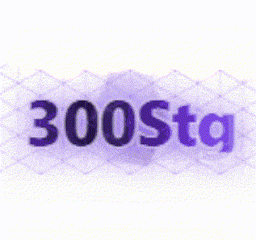
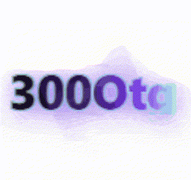
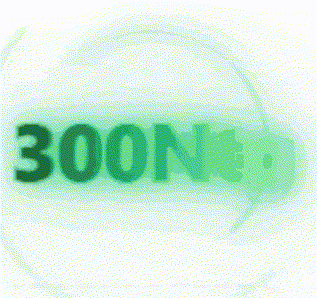
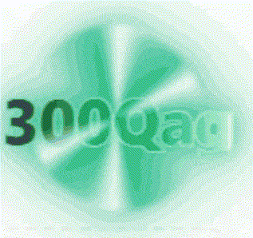
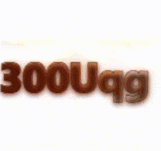
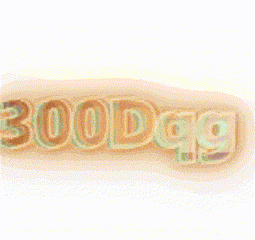
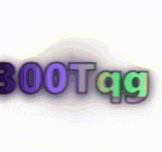
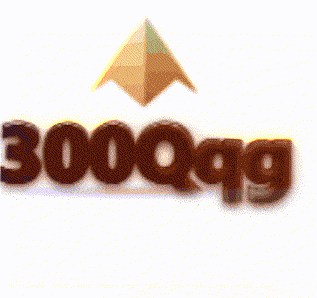
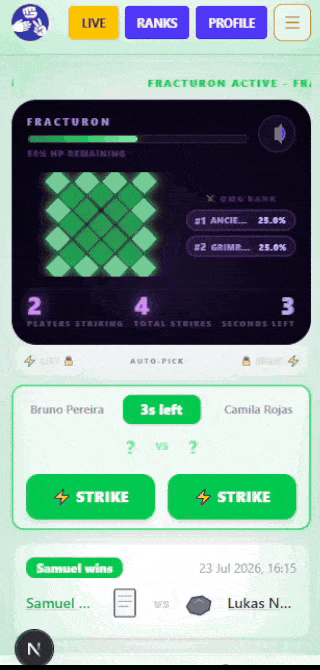

# ⚔️ World Bosses

A showcase of all World Bosses, including their visual designs, encounter mechanics, chest reward systems, and introduced number tiers.

---

# Global Encounter Rules

## Encounter Flow

- **Synchronized Encounters**: Every connected client receives the exact same boss state, HP updates, and damage leaderboard data from the backend in real-time via Server-Sent Events (SSE).
- **Three-Phase Lifecycle**:
  - **Cooldown**: A randomized 10 to 12-minute quiet period between encounters before the next boss is selected.
  - **Warning Phase**: A 30-second period alerting players of an incoming boss. The Oracle announces the boss arrival and its name.
  - **Active Phase**: A 60-second encounter window replacing the prediction arena entirely. Every prediction becomes a damage strike against the shared boss HP pool.
- **Collective HP Scaling**: Boss HP starts at zero and grows dynamically as players join the encounter. Each unique participant contributes HP based on when they arrive:
  - Join in the first 15 seconds: +4 HP
  - Join between 15 and 30 seconds: +3 HP
  - Join between 30 and 45 seconds: +2 HP
  - Join in the final 15 seconds: +1 HP
- **Encounter Outcome**: Boss HP depleted to zero results in a **DEFEAT**. Timer expiring with HP remaining results in a **RETREAT**. Both outcomes reward all participants with chests.
- **Oracle Integration**: The Oracle announces the boss arrival during the warning phase and vocalizes the spawn at encounter start. No countdown alerts fire during World Boss phases.

## Shared Combat Mechanics

Every World Boss currently uses the same combat rules.

- Winning predictions deal **1 damage** to the shared HP pool.
- **Temporal Charge** increases successful hits during the first 10 seconds to **2 damage**.
- **Omega Shard** grants a **10% chance** for any successful hit to deal **3 damage**.
- **Phantom Reach** allows missed predictions to contribute **0.5 average damage** on a **50% proc**.

---

## Chest Reward System

All participants who land at least one hit receive a chest at encounter end. Chest rarity is determined by the encounter outcome and collective HP depleted.

| Outcome | Condition | Chest Rarity |
|---------|-----------|--------------|
| DEFEAT | Boss fully destroyed | Mythical |
| RETREAT | 75% or more HP depleted | Legendary |
| RETREAT | 50% or more HP depleted | Epic |
| RETREAT | 25% or more HP depleted | Rare |
| RETREAT | Less than 25% HP depleted | Common |
| Any | Prism Key relic + successful upgrade roll | Rainbow |

Point rewards are calculated as a percentage of the player's current balance, scaling from **0.5%** at Common to **7.5%** at Rainbow. Equipping chest-focused relics raises this percentage additively.

---

## World Boss Relics

Fourteen new relics drop exclusively from World Boss chests and never from standard predictions.

- **Point Bonus Relics**
  - Fortune Satchel
  - King's Purse
  - Royal Treasury
  - Dragon's Hoard
  - Increase chest point rewards from **+25%** through **+150%**.

- **Relic Appearance Relics**
  - Treasure Compass
  - Relic Magnet
  - Vault Key
  - Collector's Vault
  - Increase relic appearance chance from **+25%** through **+150%**.

- **Upgrade Chance Relics**
  - Lucky Crest
  - Fortune Seal
  - Ascension Sigil
  - Celestial Crown
  - Increase chest upgrade chance from **+10%** through **+50%**.

- **Mythical Specials**
  - **Twin Fortune**: 25% chance to duplicate the entire chest reward.
  - **Prism Key**: Enables the Rainbow chest tier when combined with any upgrade-chance relic.

---

## ⬡ Hexurion

A geometric lattice entity constructed from three nested hexagonal prism shells rotating at differing speeds around a fixed luminous core. The outer shell rotates slowly. The inner shell accelerates. The core dot never dims.

### Visual Behavior

- Idle: Three nested hexagonal prism shells rotate independently around a luminous core.
- Hit: Boss winces and shudders on every successful strike.
- Death: Outer shells spin outward and dissolve while the core slowly fades.

  <strong>Hexurion Encounter</strong> 
  

### Introduced Tiers

| Tier | Scale | Tag | Preview | Description |
|------|-------|-----|---------|-------------|
| Septentrigintillion | 10¹¹⁴ | reinforced lattice / stg |  | Amethyst-silver typography framed by a pristine white-lavender outline, backed by a breathing isometric hexagonal lattice and a slowly rotating crystalline prism core. |
| Octotrigintillion | 10¹¹⁷ | hard-light breach / otg |  | Electric indigo typography surrounding a blazing cyan core, accompanied by a rotating hexagonal light portal and continuously shattering energy barriers. |

---

## 🪐 Orphion

A gravitational anomaly composed of three concentric orbital rings rotating in alternating directions around a pulsing spherical core. Each ring carries a single node at its peak. The rings orbit independently at varying speeds, never aligning.

### Visual Behavior

- Idle: Three orbital rings rotate independently around a pulsing core.
- Hit: All three rings explode outward before snapping back into orbit.
- Pain: Core briefly inverts brightness before restoring.
- Death: Rings flatten into horizontal lines and dissolve from the outside inward.

  <strong>Orphion Encounter</strong> 
  

### Introduced Tiers

| Tier | Scale | Tag | Preview | Description |
|------|-------|-----|---------|-------------|
| Novemtrigintillion | 10¹²⁰ | singularity orbit / ntg |  | Emerald-and-mint typography wrapped in dual counter-rotating orbital halos, creating the illusion of a compact artificial singularity. |
| Quadragintillion | 10¹²³ | event horizon / qag |  | Brilliant emerald typography surrounded by layered concentric accretion disks rotating at non-harmonic speeds, simulating a hyper-velocity cosmic event horizon. |

---

## 💠 Fracturon

A rhombic data-lattice entity built from a 7×7 cell grid rotated 45 degrees and clipped into a diamond silhouette. The outer ring of cells glows brighter than the interior cells. Its idle state is a sustained digital heartbeat, collapsing vertically before snapping back every four seconds.

### Visual Behavior

- Idle: Diamond lattice performs a heartbeat collapse every four seconds.
- Hit: Entire grid whips laterally before returning to center.
- Pain: Grid rapidly skews diagonally in alternating directions.
- Death: Diamond uniformly shrinks to a single point before vanishing.

  <strong>Fracturon Encounter</strong> 
  

### Introduced Tiers

| Tier | Scale | Tag | Preview | Description |
|------|-------|-----|---------|-------------|
| Unquadragintillion | 10¹²⁶ | prism scanner / uqg |  | Polished copper-gold typography illuminated by a sweeping laser scan across a pulsing rhombus grid, recreating the look of a high-fidelity digital scanning interface. |
| Duoquadragintillion | 10¹²⁹ | spectrum corruption / dqg |  | Radiant amber typography surrounded by severe digital corruption effects, layered with cyan and magenta ghost copies that jitter independently under constant signal interference. |

---

## 🔺 Apexion

A monolithic triangular pyramid that breathes. Its vertical scale cycles over 2.5 seconds, expanding upward and contracting back while the ground shadow expands and contracts in sync beneath it.

### Visual Behavior

- Idle: Pyramid continuously breathes through synchronized vertical scaling.
- Hit: Pyramid stretches toward the viewer before slamming back into shape.
- Pain: Entire model briefly inverts color for a single frame.
- Death: Pyramid collapses into a horizontal line before fading away.

  <strong>Apexion Encounter</strong> 
  

### Introduced Tiers

| Tier | Scale | Tag | Preview | Description |
|------|-------|-----|---------|-------------|
| Tresquadragintillion | 10¹³² | holographic monolith / tqg |  | Amethyst-and-silver typography animated by chromatic holographic sweeps, backed by a breathing pyramid core, scrolling matrix grid, and rotating radar field. |
| Quattuorquadragintillion | 10¹³⁵ | obsidian apex / qqg |  | Basalt-obsidian typography transitioning into molten gold with unstable violet energy surges, crowned by a floating faceted crystal suspended above a pulsing energy platform. |

---

# UI Integration

During World Boss encounters the interface undergoes several structural modifications replacing the standard prediction experience.

- **Arena Replacement**: The prediction dashboard is fully replaced by the World Boss arena. The HP bar appears at the top, the boss occupies the center, the live damage leaderboard appears on the right, and the strike counter and timer anchor the bottom.
- **Sound Control Preserved**: The sound control popover remains available in the top-right corner.
- **Relic Locking**: Relic equipping and unequipping is disabled while an encounter is active.
- **Damage Leaderboard**: Live top-three damage rankings display as a percentage of total boss HP. Players outside the top three see their own rank beneath the leaderboard.
- **Hit Feedback**: Successful predictions trigger a cyan bloom flash with a floating **STRIKE** label. Misses trigger a red border flash with **BLOCKED**. Multi-damage hits display **STRIKE ×2** or **CRIT ×3**.
- **System Coordination**: Active Global Event and Festival timers pause during encounters and resume afterward with their remaining time.
- **Oracle Audio**: The Oracle announces the incoming boss during the warning phase and announces the encounter again when it begins.

## Boss Audio

| Event | Trigger |
|---|---|
| Spawn | Encounter becomes active and assembly animation begins |
| Take Damage | Player prediction successfully deals damage |
| Attack | Player prediction misses and the boss blocks |
| Death | Boss HP reaches zero |

Every boss has a unique audio set covering all four events.

---

## Boss Retreat

World Boss encounters always reward every participant who lands at least one hit, even if the boss retreats when the timer expires. Chest rarity depends on the percentage of HP depleted.

  <strong>Boss Retreat Reward</strong> 
  

